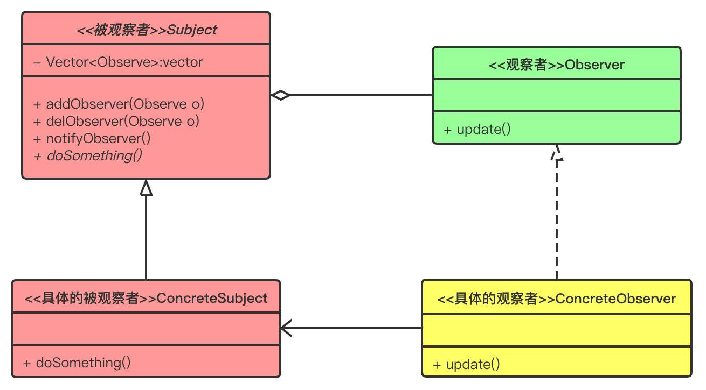

## 观察者模式

定义对象间一种一对多的依赖关系，使得当每一个对象改变状态，则所有依赖于它的对象都会得到通知并自动更新。

是一种**对象行为型模式**。


## 角色

#### Subject(目标)

被观察者，指被观察的对象。类中有一个用来存放观察者对象的Vector 容器。这个Vector容器是被观察者类的核心。

另外还有三个方法：

attach方法是向这个容器中添加观察者对象；

detach方法是从容器中移除观察者对象；

notify方法是依次调用观察者对象的对应方法。

这个角色可以是接口，也可以是抽象类或者具体的类，因为很多情况下会与其他的模式混用，所以使用抽象类的情况比较多。

#### ConcreteSubject(具体目标)

具体目标是目标类（Subject）的子类，通常它包含经常发生改变的数据。

当它的状态发生改变时，向它的各个观察者发出通知。

同时它还实现了在目标类中定义的抽象业务逻辑方法（如果有的话）。如果无须扩展目标类，则具体目标类可以省略。

#### Observer(观察者)

观察者将对观察目标的改变做出反应，观察者一般定义为**接口**，该接口声明了更新数据的方法 `update()`，因此又称为**抽象观察者**。

#### ConcreteObserver(具体观察者)

在具体观察者中维护一个指向具体目标对象的引用，它存储具体观察者的有关状态，这些状态需要和目标的状态保持一致。

它实现了在抽象观察者 Observer 中定义的 update()方法。

通常在实现时，可以调用具体目标类的 attach() 方法将自己添加到目标类的集合中或通过 detach() 方法将自己从目标类的集合中删除。


## 类图



## 实例

#### 定义观察者接口

```java
public interface Observer {
    void update();
}
```

#### 定义被观察者

```java
public abstract class Subject {
    private Vector<Observer> obs = new Vector();

    public void addObserver(Observer obs) {
        this.obs.add(obs);
    }

    public void delObserver(Observer obs) {
        this.obs.remove(obs);
    }

    protected void notifyObserver() {
        for (Observer o : obs) {
            o.update();
        }
    }

    public abstract void doSomething();
}
```

#### 具体的被观察者

```java
public class ConcreteSubject extends Subject {
    @Override
    public void doSomething() {
        System.out.println("被观察者事件发生改变");
        this.notifyObserver();
    }
}
```

#### 具体的观察者

```java
public class ConcreteObserver1 implements Observer {
    @Override
    public void update() {
        System.out.println("观察者1收到信息，并进行处理");
    }
}

public class ConcreteObserver2 implements Observer {
    @Override
    public void update() {
        System.out.println("观察者2收到信息，并进行处理");
    }
}
```

#### 客户端

```java
public class Client {
    public static void main(String[] args){
        Subject sub = new ConcreteSubject();
        //添加观察者1
        sub.addObserver(new ConcreteObserver1());
        //添加观察者2
        sub.addObserver(new ConcreteObserver2());
        
        sub.doSomething();
    }
}
```

#### 输出

```java
被观察者事件发生改变
观察者1收到信息，并进行处理
观察者2收到信息，并进行处理
```


## 优缺点

### 优点

- 降低了目标与观察者之间的耦合关系，两者之间是抽象耦合关系。
- 目标与观察者之间建立了一套触发机制。
- 支持广播通信
- 符合“开闭原则”的要求

### 缺点

- 目标与观察者之间的依赖关系并没有完全解除，而且有可能出现循环引用。
- 当观察者很多时，通知的发布会花费很多时间，影响程序的效率。


## 应用

### JDK 中的观察者模式

jdk 的 java.util 包中，提供了 Observable 类以及 Observer 接口。构成了 jdk 对观察者模式的支持。

Java9 被弃用了。


### Spring 中的观察者模式

Spring 中观察者模式的四个角色。

1. **事件**：**ApplicationEvent** 是所有事件对象的父类。ApplicationEvent 继承自 jdk 的 EventObject，所有的事件都需要继承 ApplicationEvent，并且通过 source 得到事件源。

   Spring 也为我们提供了很多内置事件，`ContextRefreshedEvent`、`ContextStartedEvent`、`ContextStoppedEvent`、`ContextClosedEvent`、`RequestHandledEvent`。

2. **事件监听**：**ApplicationListener**，也就是观察者，继承自 jdk 的 EventListener，该类中只有一个方法 onApplicationEvent。当监听的事件发生后该方法会被执行。

3. **事件源：ApplicationContext**，`ApplicationContext` 是 Spring 中的核心容器，在事件监听中 ApplicationContext 可以作为事件的发布者，也就是事件源。因为 ApplicationContext 继承自 ApplicationEventPublisher。在 `ApplicationEventPublisher` 中定义了事件发布的方法：`publishEvent(Object event)`。

4. **事件管理：ApplicationEventMulticaster**，用于事件监听器的注册和事件的广播。监听器的注册就是通过它来实现的，它的作用是把 Applicationcontext 发布的 Event 广播给它的监听器列表。