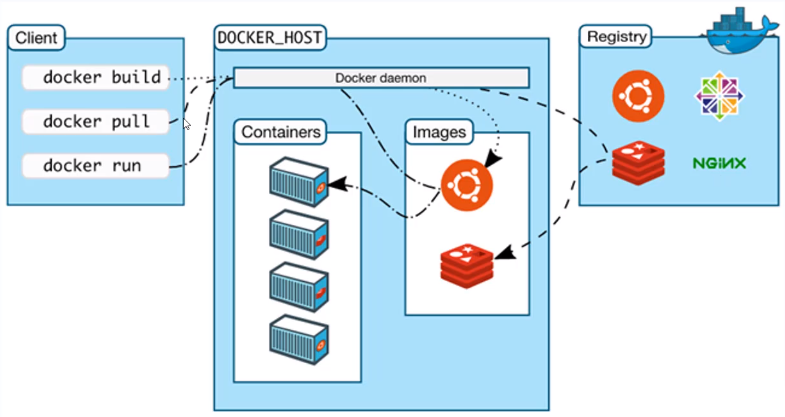
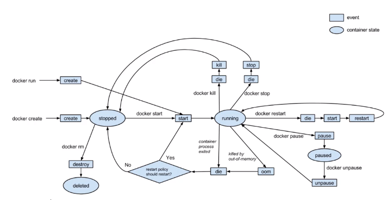
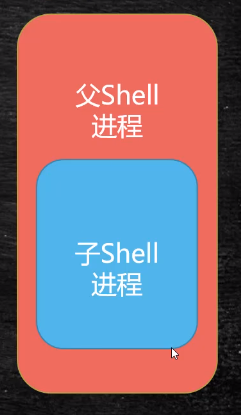

## docker 基本概念

​		提供应用打包，部署于运行应用的容器化平台。

#### 容器与镜像

##### 镜像

​		镜像是文件，只读，提供了运行程序完整的软硬件资源，是应用程序的"集装箱"。

##### 容器

​		是镜像的实力，由docker负责创建，容器之间彼此隔离。

#### docker执行流程



#### docker内部结构

```shell
# 进入容器内部
docker exec -it 容器id /bin/bash

# 查看linux内核版本
cat /proc/version

# 退出
exit

# 镜像容器默认存放目录
cd /ver/lib/docker
```


#### 容器生命周期




#### dockerfile 运行指令

docker build：创建镜像

​		RUN执行，在构建镜像时执行命令

docker run：创建容器

​		CMD|ENTRYPOINT，在容器创建时执行命令


#### shell 运行方式

​		使用 shell 执行时，当前 shell 是父进程，生成一个子 shell 进程。

​		在子shell中执行脚本。脚本执行完毕，退出子shell，回到当前 shell。



#### exec 运行方式

​		使用 exec 方式，会用 exec 进程替换当前进程，并且保持 PID 不变。

​		执行完毕，直接退出，并不会退回之前的进程环境。


## docker 安装

```shell
# 安装 工具包 和 数据存储驱动包
yum install -y yum-utils device-mapper-persistent-data lvm2

# 用于设置安装源 修改安装源
yum-confing-manager --add-repo http://mirrors.aliyun.com/docker-ce/linux/centos/docker-ce.repo

# 自动检测哪个安装源最快优先使用
yum makecache fast

# 安装环节
yum -y install docker-ce

# 启动 docker
service docker start

# 验证是否启动 查看docker版本号
docker version 

# 从国外项目抽取到本地
docker pull hello-world

# 运行
docker run hello-world
```


## 阿里云docker镜像加速

```shell
# 访问阿里郧访问镜像服务
```


## dockerfile 构建镜像

````shell
docker build -t 企业名/镜像名:<tags>
docker build -t mashibing.com/mywebapp:1.0

docker run -d -p 8001:8080 test.com/mywebapp:1.0 /usr/image/fist-dockerfile/
# 如果在当前目录 .
docker rum -d -p 8001:8080 test.com/mywebapp:1.0 .
````


## 镜像分层

​		每执行一步，都会创建一个临时容器。


