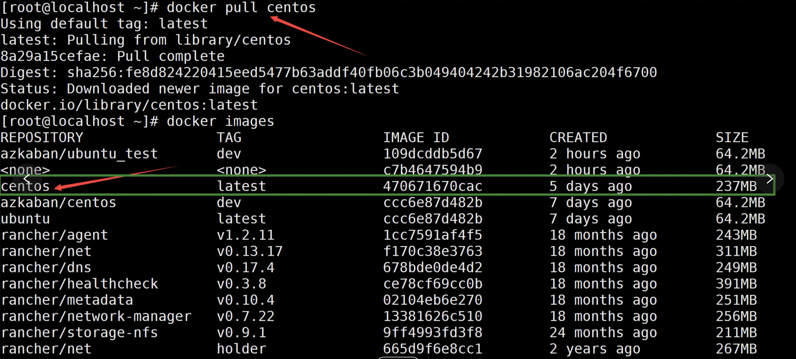

## 基本结构

- 基础镜像信息
- 维护者信息
- 镜像操作指令
- 容器启动时执行指令
- #为 dockerfile 中的注释


## 创建容器基本步骤

1. 编写 dockerfile 文件
2. docker build
3. docker run

### 企业案例

1. 通过 dockerfile 自定义 centos 镜像

   ```shell
   docker pull centos
   ```

   

   官方镜像

   ```shell
   docker run -i -t 470671670cac
   ```

   官方镜像不支持，我们需要自定义一个镜像来支持 vim、ifconfig、并且登录后的默认路径做修改。


## 常见命令

#### FROM

​		基础镜像 —— 他的妈妈是谁

​		格式为 FROM image 或 From image:tag，dockerfile 中第一条指令必须是 FROM 指令，且在同一个 dockerfile 中创建多个镜像时可以使用多个 FROM 指令。

#### MAINTAINER

​		运维人员/维护人员 —— 维护者信息

#### RUN

​		你想让他做什么

#### CMD

​		三种格式：

- CMD ["executable", "param1", "param2"]，使用 exec执行，这是推荐的方式。
- CMD command param1 param2 在/bin/sh 中执行
- CMD ["param1", "param2"] 提供给 ENTERYPOINT 的默认参数。

​		CMD用于指定容器启动时执行的命令，每个dockerfile只能有一个CMD命令，多个CMD命令只执行最后一个。若容器启动时制定了运行的命令，则会覆盖掉CMD中指定的命令。

#### ADD

​		向镜像中添加点什么东西 —— copy文件/会自动解压

​		ADD src dest。可以是一个绝对路径，也可以是一个URL或一个tar文件。

#### COPY

​		COPY src desc

​		复制本机主机src目录或文件到容器 desc目录，desc不存在时会自动创建。

#### ENTRYPOINT

​		用于配置容器启动后执行的命令，不能被docker run提供的参数覆盖。和CMD一样，每个 dockerfile中只能有一个ENTRYPOINT，当有多个时最后一个生效。

#### WORKDIR

​		当前的工作目录

#### ONBUILD

​		该配置指定当所创建的镜像作为其他新建镜像的基础镜像时所执行的指令。

​		例如

#### VOLUME

​		挂载卷 —— 你给我一个地方存放行李箱

#### EXPOSE

​		开放容器端口

​		在启动容器的时候使用-P，docker会自动分配一个端口和转发指定的端口，使用-p可以具体指定使用哪个本地的端口来映射对外开放的端口。

#### ENV

​		环境变量

#### USER

​		用谁来运行 —— root

#### 参考文档

​		https://www.jianshu.com/p/53123da7af41


## 镜像标签

​		docker tag


## 定义镜像

#### 编写dockerfile

```shell
# 从标准centos构建
FROM centos

# 定义作者信息
MAINTAINER tim<azkaban@163.com>

# 定义一个变量
ENV newpath /tmp

# 设置登录后的落脚点
WORKDIR $newpath

# 安装vim和net-tools工具
RUN yum -y install vim
RUN yun -y install net-tools

EXPOSE 80

CMD echo $newpath
CMD echo "success--------ok"
CMD /bin/bash
```

#### 开始构建

```shell
docker build -f dockerfile -t azkaban/custom_centos:dev
```

构建镜像成功 docker images查看


#### 创建容器及验证

```shell
docker run -i -t azkaban/custom centos:dev
ifconfig
mtu 65535
```

#### 查看构建过程

```shell
docker history azkaban/custom_centos:dev
```


## docker build

​		创建好dockerfile之后，通过docker build命令来创建镜像，该命令首先会上传dockerfile文件给docker服务器端，服务器端将逐行执行dockerfile中定义的指令。

​		通常建议防止dockerfile的目录为空目录。另外可以在目录下创建 .dockerignore文件，让docker忽略路径下的文件和目录，这个和git中的配置非常相似。

​		通过 -t 指定镜像的标签信息，例如：docker build -t regenzm/first_image.##"."指定的时dockerfile所在的路径。


