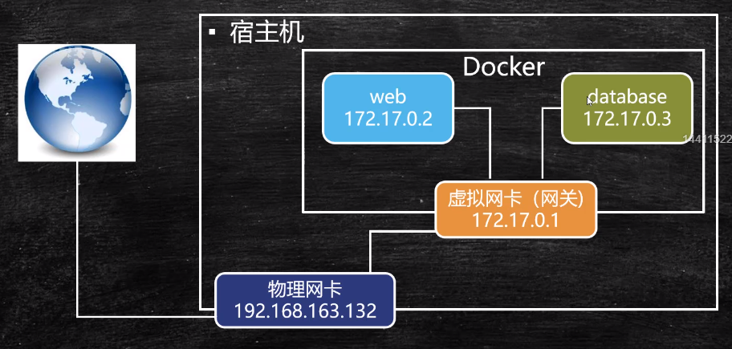
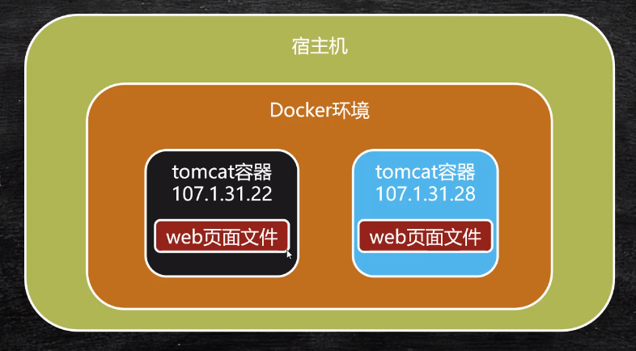
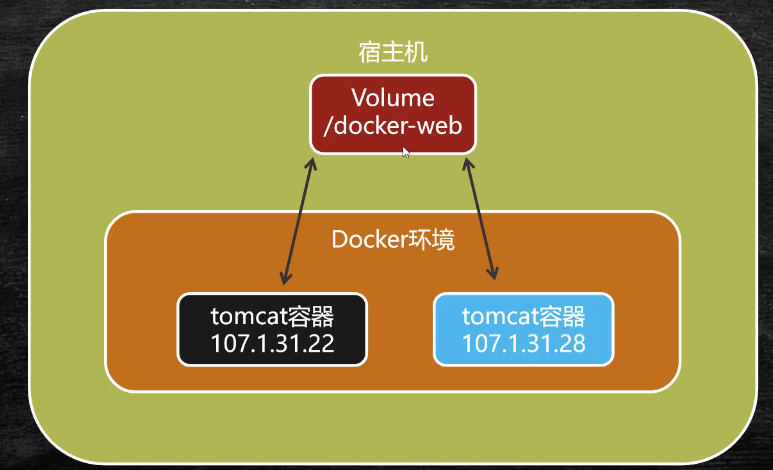

## Link 单向通信

```shell
# 将容器命名成 web
docker run -d --name web tomcat

# 查看详细信息
docker inspect 容器ID

# 直接带上 tomcat 别名
docker run -d --name web --link database tomcat
docker exec -t 容器id /bin/bash
ping database
```


## 基于Bridge网桥双向通信

网桥主要作用是与外部通信.

将两个容器绑定同一个网桥上，两个容器之间天然互通。

```shell
# 列出 docker 网络服务明细
docker network ls

# 指明新建网络类型是个网桥 指明名称
docker network create -d bridge my-bridge

# 绑定网桥
docker network connect my-bridge web
docker network connect my-bridge database

# 验证
docker exec -it 容器web的id /bin/bash
ping database
```

每创建一个网桥就等于创建一个虚拟网卡，两个容器通过虚拟网卡就可以通过虚拟网卡的网关实现内部通路。

外部数据通过物理网卡经过虚拟网卡进行分发，实现通信。




## 容器间共享数据

Volume

​		计算机中称 Volume 为数据卷。





将文件存在宿主机，这样实现数据共享。


#### 通过设置 -v 挂载宿主机目录

```shell
docker run --name 容器名 -v 宿主机路径:容器内挂载路径 镜像名

docker run --name t1 -v /usr/webapps:/usr/local/tomcat/webapps tomcat
```

#### 通过 --volumes-from 共享容器内挂载点

```shell
# 创建共享容器
# 其实是定义了一个挂载点
docker create --name webpage -v /webapps:/tomcat/webapps tomcat /bin/true

# 共享容器挂载点
docker run --volumes-from webpage --name t1 -d tomcat
```

