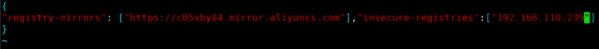

## 镜像仓库

### docker Hub

#### 	共有仓库

​		docker 官方提供的公共镜像，需要去官网注册一个docker账号。

#### 	私有的

​		docker-registry

​			docker官方提供的私有仓库解决方案

​		harbor

​			vmware公司提供的


## Harbor

#### 特性

- 基于角色的访问控制
- 镜像的复制
- LDAP/AD
- 镜像的删除和垃圾收集
- 国际化/本地化
- 图形化的用户界面
- 审计的管理

#### 架构

// todo

#### 依赖

- docker

- docker-compose

    他是托管到 github 上。所以特别慢。

    - 科学上网
    - 下载好 docker-compose 的离线安装包 

#### 搭建步骤

```shell
# 验证 docker 是否安装
docker version

# 升级
yum update

# 安装一些必要组件
yum install -y yum-utils device-mapper-persistent-data lvm2

# 配置一些源
yum-config-manager --add-repo http://mirrors.aliyun.com/docker-ce/linux/centos/docker-ce.repo

# 安装docker
yum install -y docker-ce

# 启动docker
systemctl start docker

#
systemctl enbale docker

# docker 配置好镜像加速 推荐使用阿里云加速
## todo

# 加快访问 git 速度
yum install -y git wget

# 让windows直接拖拽文件到虚拟机里或服务器上
yum install -y lrzsz
```

##### docker-compose

###### 安装harbor

安装docker-compose

```shell
# 移动文件
cp -r docker-compose-Linux-x86_64 /usr/local/bin/docker-compose

# 赋给执行权限
chmod +x /usr/local/bin/docker-compose

# 查看版本
docker-compose --version

# 解压 docker-compose 压缩包
tar -xvf harbor-offline-installer-v1.9.4.tgz -C /opt

cd /opt/harbor

./prepare

# 配置harbor
vim harbor.yml
# hostname: 外网就是域名 —— 内网可以是ip
# 默认密码 Harbor12345

# 安装
./install
```

验证

1. 打开浏览器	192.168.110.239:80
2. admin/Harbor12345


设置成开机自启动

```shell

```


###### docker客户端

```shell
vim /etc/docker/daemon.json
```

修改成自己的ip

 

```shell
# reload一下
systemctl daemon-reload
# 重启docker
systemctl restart docker

# 登陆 私有镜像仓库
docker login 192.168.110.239

# docker镜像部署到 harbor
docker push 192.168.110.239/library/centos7*64_1810:v1

# 拿掉镜像
docker rmi 192.168.110.239/library/centos7*64_1810:v1

# 从仓库把镜像下载下来
docker pull 192.168.110.239/library/centos7*64_1810:v1

```


