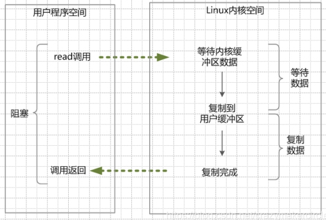
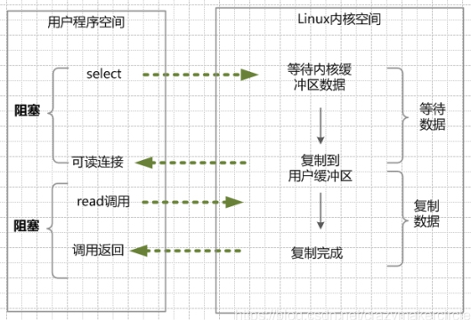
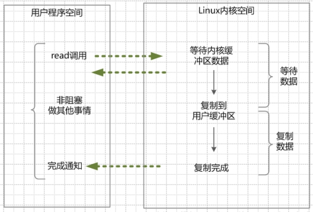

# Java IO

## Java IO 读写原理

​		无论是 Socket 的读写还是文件的读写，在 Java 层面的应用开发或者是 linux 系统底层开发，都属于输入 input 和输出 output 的处理，简称为 IO 读写。

​		在原理上和处理流程上，都是一致的。区别在于参数的不同。

> ​	read系统调用，并不是把数据直接从物理设备，读数据到内存。
>
> ​	write系统调用，也不是直接把数据，写入到物理设备。

​		read 系统调用，是把数据从内核缓冲区复制到进程缓冲区；

​		write 系统调用，是把数据从进程缓冲区复制到内核缓冲区。

#### 内核缓冲与进程缓冲区

缓冲区目的：减少频繁的系统 IO 调用。

​		系统调用需要保存之前的进程数据和状态等信息，而结束调用之后回来还需要恢复之前的信息，为了减少这种损耗时间、也损耗性能的系统调用，于是出现了缓冲区。

​		操作系统使用 read 函数把数据从内核缓冲区复制到进程缓冲区，write 把数据从进程缓冲区复制到内核缓冲区中。

​		等待缓冲区达到一定数量的时候，再进行 IO 的调用，提升性能。至于什么时候读取和存储则由内核来决定，用户程序不需要关心。

> 在linux系统中，系统内核也有个缓冲区叫做内核缓冲区。每个进程有自己独立的缓冲区，叫做进程缓冲区。

> 用户程序的IO读写程序，大多数情况下，并没有进行实际的IO操作，而是在读写自己的进程缓冲区。

#### Java IO 读写底层流程

​		用户程序进行 IO 的读写，基本上会用到系统调用 read&write，read 把数据从内核缓冲区复制到进程缓冲区，write 把数据从进程缓冲区复制到内核缓冲区，它们不等价于数据在内核缓冲区和磁盘之间的交换。

经典流程：

1. 客户端请求：

   ​		linux 通过网卡，读取客户断的请求数据，将数据读取到内核缓冲区。

2. 获取请求数据：

   ​		服务器从内核缓冲区读取数据到 java 进程缓冲区。

1. 服务器端业务处理

   ​		java 服务端在自己的用户空间中，处理客户端的请求。

2. 服务器端返回数据

   ​		java 服务端已构建好的响应，从用户缓冲区写入系统缓冲区。

3. 发送给客户端

   ​		linux 内核通过网络 I/O ，将内核缓冲区中的数据，写入网卡，网卡通过底层的通讯协议，会将数据发送给目标客户端。

## 四种主要 IO 模型

#### 概述

- **同步阻塞 IO：**

  ​		指需要内核 IO 操作彻底完成后，才返回到用户空间，执行用户操作。

  ​		阻塞指的是用户空间程序的执行状态，用户空间程序需等到 IO 操作彻底完成。传统的 IO 模型都是同步阻塞 IO。java 中，默认创建的 socket 都是阻塞的。

- **同步非阻塞 IO：**

  ​		非阻塞 IO，指的是用户程序不需要等待内核 IO 操作完成后，内核立即返回给用户一个状态值，用户空间无需等到内核的 IO 操作彻底完成，可以立即返回用户空间，执行用户的操作，处于非阻塞的状态。

  ​		阻塞是指用户空间（调用线程）一直在等待，而且别的事情什么都不做。

  ​		非阻塞是指用户空间（调用线程）拿到状态就返回，IO 操作可以干就干，不可以干，就去干的事情。

  > 非阻塞IO要求socket被设置为NONBLOCK。

  > 这里所说的NIO（同步非阻塞IO）模型，并非 java 的 NIO（New IO）库。

- **同步 IO：**

  ​		是一种用户空间与内核空间的调用发起方式。

  ​		同步 IO 是指用户空间线程是主动发起 IO 请求的一方，内核空间是被动接受方。

  ​		异步 IO 则反过来，是指内核 kernel 是主动发起 IO 请求的一方，用户线程是被动接受方。

- **异步 IO：**

  ​		异步 IO，指的是用户空间与内核空间的调用方式反过来。用户空间线程是变成被动接受的，内核空间是主动调用者。

  ​		有点类似于 java 中的回调模式，用户空间线程向内核空间注册各种 IO 事件的回调函数，由内核去主动调用。

- **IO 多路复用：**

  ​		即经典的 Reactor 设计模式，有时也称为异步阻塞 IO，Java 中的 Selector 和 Linux 中的 epoll 都是这种模型。

#### 同步阻塞 IO（Blocking IO）BIO

​		linux 的 java 进程中，默认情况所有的 socket 都是 blocking io。应用程序在从 IO 系统调用开始，一直到系统调用返回，都是阻塞的。

流程：

1. 用户线程调用了 read 系统调用，kernel 开始了 IO 的第一个阶段：准备数据。很多时候，数据一开始还没有到达（例：还没收到一个完整的 socket 数据包），这时候 kernel 就要等待足够的数据到来。
2. 当 kernel 等到的数据准备号了，就会将数据从 kernel 内核缓冲区拷贝到用户缓冲区（用户内存），然后 kernel 返回结果。
3. 从开始 IO 读的 read 系统调用开始，用户线程就进入阻塞状态。直到 kernel 返回结果，用户线程接触 block 状态，重新运行起来。

> blocking IO 特点：内核进行 IO 执行的两个阶段，用户线程都被 block 了。

##### 优点

在阻塞等待数据期间，用户线程挂起。用户线程基本不会占用 CPU 资源。

##### 缺点

一般情况下，会为每个连接配套一条独立的线程，或者说一条线程维护一个连接成功的 IO 流的读写。

并发量小的情况下，这个没有什么问题。

当在高并发的场景下，需要大量的线程来维护大量的网络连接，内存、线程切换开销会非常巨大。

基本上，BIO 模型在高并发场景下是不可用的。

#### 同步非阻塞 IO（Non-blocking IO）NIO

​		在 linux 系统下，可以通过设置 socket 使其变为 non-blocking。NIO 模型中应用程序在一旦开始 IO 系统调用，会出现以下两种情况：

1. 在内核缓冲区没有数据的情况下，系统调用会立即返回，返回一个调用失败的信息。
2. 在内核缓冲区有数据的情况下，是阻塞的，直到数据从内核缓冲复制到用户进程缓冲。复制完成后，系统调用返回成功，应用进程开始处理用户空间的缓存数据。

流程：

1. 内核数据没有准备好的阶段，用户线程发起 IO 请求时，立即返回。用户线程需要不断地发起 IO 系统调用。
2. 内核数据到达后，用户线程发起系统调用，用户线程阻塞。内核开始复制数据。它就会将数据从 kernel 内核缓冲区，拷贝到用户缓冲区（用户内存），然后kernel返回结果。
3. 用户线程才解除 block 的状态，重新运行起来。经过多次的尝试，用户线程终于真正读取到数据，继续执行。

> nio 特点：应用程序的线程需要不断的进行 I/O 系统调用，轮询数据是否已经准备好，如果没有准备好，继续轮询，直到完成系统调用为止。

##### 优点

每次发起的 IO 系统调用，在内核的等待数据过程中可以立即返回。用户线程不会阻塞，实时性较好。

##### 缺点

需要不断的重复发起IO系统调用，这种不断的轮询，将会不断地询问内核，这将占用大量的 CPU 时间，系统资源利用率较低。

NIO模型在高并发场景下，也是不可用的。

一般 Web 服务器不使用这种 IO 模型。一般很少直接使用这种模型，而是在其他 IO 模型中使用非阻塞 IO 这一特性。java 的实际开发中，也不会涉及这种 IO 模型。

Java NIO（New IO）不是 IO 模型中的 NIO 模型，而是另外的一种模型，叫做 IO 多路复用模型（ IO multiplexing ）。

#### IO 多路复用（IO Multiplexing）

​		IO 多路复用模型，就是通过一种新的系统调用，一个进程可以监视多个文件描述符，一旦某个描述符就绪（一般是内核缓冲区可读/可写），内核kernel能够通知程序进行相应的 IO 系统调用。

​		目前支持 IO 多路复用的系统调用，有 select，epoll 等等。select 系统调用，是目前几乎在所有的操作系统上都有支持，具有良好跨平台特性。epoll 是在 linux 2.6 内核中提出的，是 select 系统调用的 linux 增强版本。

​		IO 多路复用模型的基本原理就是 select/epoll 系统调用，单个线程不断的轮询 select/epoll 系统调用所负责的成百上千的 socket 连接，当某个或者某些 socket 网络连接有数据到达了，就返回这些可以读写的连接。因此，好处也就显而易见了——通过一次 select/epoll 系统调用，就查询到到可以读写的一个甚至是成百上千的网络连接。

​		这种模式中，首先不是进行 read 系统调动，而是进行 select/epoll 系统调用。当然，这里有一个前提，需要将目标网络连接，提前注册到 select/epoll 的可查询 socket 列表中。然后，才可以开启整个的 IO 多路复用模型的读流程。

1. 进行 select/epoll 系统调用，查询可以读的连接。kernel 会查询所有 select 的可查询 socket 列表，当任何一个 socket 中的数据准备好了，select 就会返回。

   当用户进程调用了select，那么整个线程会被block（阻塞掉）。

2. 用户线程获得了目标连接后，发起 read 系统调用，用户线程阻塞。内核开始复制数据。它就会将数据从 kernel 内核缓冲区，拷贝到用户缓冲区（用户内存），然后 kernel 返回结果。

3. 用户线程才解除 block 的状态，用户线程终于真正读取到数据，继续执行。

> 特点：
>
> IO 多路复用模型，建立在操作系统 kernel 内核能够提供的多路分离系统调用 select/epoll 基础之上的。多路复用 IO 需要用到两个系统调用（system call）， 一个 select/epoll 查询调用，一个是 IO 的读取调用。
>
> 和 NIO 模型相似，多路复用 IO 需要轮询。负责 select/epoll 查询调用的线程，需要不断的进行 select/epoll 轮询，查找出可以进行 IO 操作的连接。
>
> 另外，多路复用IO模型与前面的 NIO 模型，是有关系的。对于每一个可以查询的 socket，一般都设置成为 non-blocking 模型。只是这一点，对于用户程序是透明的（不感知）。

##### 优点

​		用 select/epoll 的优势在于，它可以同时处理成千上万个连接（connection）。与一条线程维护一个连接相比，I/O 多路复用技术的最大优势是：系统不必创建线程，也不必维护这些线程，从而大大减小了系统的开销。

Java 的 NIO（new IO）技术，使用的就是 IO 多路复用模型。在 linux 系统上，使用的是 epoll 系统调用。

##### 缺点

本质上，select/epoll 系统调用，属于同步 IO，也是阻塞 IO。都需要在读写事件就绪后，自己负责进行读写，也就是说这个读写过程是阻塞的。

#### 异步 IO（Asynchronous IO）AIO

**基本流程**

​		用户线程通过系统调用，告知 kernel 内核启动某个 IO 操作，用户线程返回。

​		kernel 内核在整个 IO 操作（包括数据准备、数据复制）完成后，通知用户程序，用户执行后续的业务操作。

> kernel 的数据准备是将数据从网络物理设备（网卡）读取到内核缓冲区。
>
> kernel 的数据复制是将数据从内核缓冲区拷贝到用户程序空间的缓冲区。

流程：

1. 当用户线程调用了 read 系统调用，立刻就可以开始去做其它的事，用户线程不阻塞。
2. 内核（kernel）就开始了 IO 的第一个阶段：准备数据。当 kernel 一直等到数据准备好了，它就会将数据从 kernel 内核缓冲区，拷贝到用户缓冲区（用户内存）。
3. kernel 会给用户线程发送一个信号（signal），或者回调用户线程注册的回调接口，告诉用户线程 read 操作完成了。
4. 用户线程读取用户缓冲区的数据，完成后续的业务操作。

> 特点：
>
> 在内核 kernel 的等待数据和复制数据的两个阶段，用户线程都不是 block（阻塞）的。用户线程需要接受 kernel 的 IO 操作完成的事件，或者说注册 IO 操作完成的回调函数，到操作系统的内核。所以说，异步 IO 有的时候，也叫做信号驱动 IO 。

##### 缺点

需要完成事件的注册与传递，这里边需要底层操作系统提供大量的支持，去做大量的工作。

目前来说， Windows 系统下通过 IOCP 实现了真正的异步 I/O。但是，就目前的业界形式来说，Windows 系统，很少作为百万级以上或者说高并发应用的服务器操作系统来使用。

而在 Linux 系统下，异步 IO 模型在2.6版本才引入，目前并不完善。所以，这也是在 Linux 下，实现高并发网络编程时都是以 IO 复用模型模式为主。