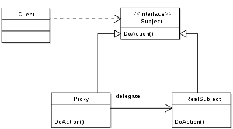

## 代理模式

是一种设计模式，提供了对目标对象额外的访问方式，即通过代理对象访问目标对象，这样可以在不修改原目标对象的前提下，提供额外的功能操作，扩展目标对象的功能。

代理模式就是设置一个中间代理来控制访问原目标对象，以达到增强原对象的功能和简化访问方式。

UML 类图



## 静态代理

这种需要代理对象和目标对象实现一样的接口

#### 优点

可以在不修改目标对象的前提下扩展目标对象的功能。

#### 缺点

1. 冗余。由于代理对象要实现与目标对象一致的接口，会产生过多的代理类。
2. 不易维护。一但接口增加方法，目标对象与代理对象都要修改。

#### 实现

##### 接口类：IUserDao

```java
package com.proxy;

public interface IUserDao {
    public void save();
}
```

##### 目标对象：UserDao

```java
package com.proxy;

public class UserDao implements IUserDao {
    
    @Override
    public void save () {
        System.out.println("保存数据");
    }
}
```

##### 静态代理对象：UserDaoProxy 

需要实现 UserDao 接口

```java
package com.proxy;

public class UserDaoProxy implements IUserDao{

    private IUserDao target;
    public UserDaoProxy(IUserDao target) {
        this.target = target;
    }
    
    @Override
    public void save() {
        //扩展了额外功能
        System.out.println("开启事务");
        target.save();
        System.out.println("提交事务");
    }
}
```

##### 测试类：TestProxy

```java
package com.proxy;

import org.junit.Test;

public class StaticUserProxy {
    @Test
    public void testStaticProxy(){
        //目标对象
        IUserDao target = new UserDao();
        //代理对象
        UserDaoProxy proxy = new UserDaoProxy(target);
        proxy.save();
    }
}
```

##### 输出结果

```java
开启事务
保存数据
提交事务
```


## 动态代理

利用了 JDK API。动态的在内存中构建代理对象，从而实现对目标对象的代理功能。动态代理又被称为 JDK 代理或接口代理。

#### 静态代理与动态代理区别

- 静态代理在编译时就已经实现，编译完成后代理类是一个实际的 class 文件。
- 动态代理是在运行时动态生成的，即编译完成后没有实际的 class 文件，而是在运行时动态生成类字节码，并加载到 jvm 中。

#### 特点

动态代理对象不需要实现接口，但是要求目标对象必须实现接口，否则不能使用动态代理。

JDK 中生成代理对象主要涉及的类：

- java.lang.reflect.Proxy，主要方法为

  ```java
  static Object newProxyInstance(
      ClassLoader loader,		//指定当前目标对象使用类加载器
      Class<?>[] interfaces,	//目标对象实现的接口的类型
      InvocationHandler h		//事件处理器
  ) 
  //返回一个指定接口的代理类实例，该接口可以将方法调用指派到指定的调用处理程序。
  ```

- java.lang.reflect.InvocationHandler，主要方法为

  ```java
  public Object invoke(Object proxy, Method method, Object[] args)
  // 在代理实例上处理方法调用并返回结果。
  ```

#### 实现

保存用户功能的动态代理实现

##### 接口类：IUserDao

```java
package com.proxy;

public interface IUserDao {
    public void save();
}
```

##### 目标对象：UserDao

```java
package com.proxy;

public class UserDao implements IUserDao{
    
    @Override
    public void save() {
        System.out.println("保存数据");
    }
}
```

##### 动态代理对象：UserProxyFactory

```java
package com.proxy;

import java.lang.reflect.InvocationHandler;
import java.lang.reflect.Method;
import java.lang.reflect.Proxy;

public class ProxyFactory {
    
	// 维护一个目标对象
    private Object target;

    public ProxyFactory(Object target) {
        this.target = target;
    }

    // 为目标对象生成代理对象
    public Object getProxyInstance() {
        return Proxy.newProxyInstance(target.getClass().getClassLoader(), target.getClass().getInterfaces(),
                new InvocationHandler() {

                    @Override
                    public Object invoke(Object proxy, Method method, Object[] args) throws Throwable {
                        System.out.println("开启事务");

                        // 执行目标对象方法
                        Object returnValue = method.invoke(target, args);

                        System.out.println("提交事务");
                        return null;
                    }
                });
    }
}
```

##### 测试类：TestProxy

```java
package com.proxy;

import org.junit.Test;

public class TestProxy {

    @Test
    public void testDynamicProxy (){
        IUserDao target = new UserDao();
        System.out.println(target.getClass());  //输出目标对象信息
        IUserDao proxy = (IUserDao) new ProxyFactory(target).getProxyInstance();
        System.out.println(proxy.getClass());  //输出代理对象信息
        proxy.save();  //执行代理方法
    }
}
```

##### 输出结果

```java
class com.proxy.UserDao
class com.sun.proxy.$Proxy4
开启事务
保存数据
提交事务
```


## cglib代理

是一个第三方代码生成类库，运行时在内存中动态生成一个子类对象从而实现对目标对象功能的扩展。

#### 特点

- JDK 的动态代理有一个限制，就是使用动态代理的对象必须实现一个或多个接口。

  如果想代理没有实现接口的类，就可以使用 CGLIB 实现。

- CGLIB 是一个强大的高性能的代码生成包，可以在运行期扩展 Java 类与实现 Java 接口。

  广泛被许多 AOP 框架使用，例：Spring AOP、dynaop，为他们提供方法的 interception（拦截）。

- CGLIB 包的底层是通过使用一个小而快的字节码处理框架 ASM，来转换字节码并生成新的类。

  不鼓励直接使用 ASM，因为它需要你对 jvm 内部结构包括 class 文件的格式和指令集都很熟悉。

#### cglib 与 动态代理最大的区别

- 使用动态代理的对象必须实现一个或多个接口。
- 使用 cglib 代理的对象则无需实现接口，达到代理类无侵入。

##### cglib 的 maven 坐标

```xml
<dependency>
    <groupId>cglib</groupId>
    <artifactId>cglib</artifactId>
    <version>3.2.5</version>
</dependency>
```

##### 目标对象：UserDao

```java
package com.cglib;

public class UserDao{

    public void save() {
        System.out.println("保存数据");
    }
}
```

##### 代理对象：ProxyFactory

```java
package com.cglib;

import java.lang.reflect.Method;

import net.sf.cglib.proxy.Enhancer;
import net.sf.cglib.proxy.MethodInterceptor;
import net.sf.cglib.proxy.MethodProxy;

public class ProxyFactory implements MethodInterceptor{

    //维护一个目标对象
    private Object target;
    public ProxyFactory(Object target) {
        this.target = target;
    }
    
    //为目标对象生成代理对象
    public Object getProxyInstance() {
        //工具类
        Enhancer en = new Enhancer();
        //设置父类
        en.setSuperclass(target.getClass());
        //设置回调函数
        en.setCallback(this);
        //创建子类对象代理
        return en.create();
    }

    @Override
    public Object intercept(Object obj, Method method, Object[] args, MethodProxy proxy) throws Throwable {
        System.out.println("开启事务");
        // 执行目标对象的方法
        Object returnValue = method.invoke(target, args);
        System.out.println("关闭事务");
        return null;
    }
}
```

##### 测试类：TestProxy

```java
package com.cglib;

import org.junit.Test;

public class TestProxy {

    @Test
    public void testCglibProxy(){
        //目标对象
        UserDao target = new UserDao();
        System.out.println(target.getClass());
        //代理对象
        UserDao proxy = (UserDao) new ProxyFactory(target).getProxyInstance();
        System.out.println(proxy.getClass());
        //执行代理对象方法
        proxy.save();
    }
}
```

##### 输出结果

```java
class com.cglib.UserDao
class com.cglib.UserDao$$EnhancerByCGLIB$$552188b6
开启事务
保存数据
关闭事务
```


## 总结

1. 静态代理实现较简单，只要代理对象对目标对象进行包装，即可实现增强功能，但静态代理只能为一个目标对象服务，如果目标对象过多，则会产生很多代理类。

2. JDK 动态代理需要目标对象实现业务接口，代理类只需实现 InvocationHandler 接口。

3. 动态代理生成得类为 class com.sun.proxy.Proxy

   cglib 代理生成得类为 class com.cglib.UserDao \ EnhancerByCGLIB

4. 静态代理在编译时产生 class 字节码文件，可以直接使用，效率高。

5. 动态代理必须实现 InvocationHandler 接口，通过反射代理方法，比较消耗系统性能，但可以减少代理类得数量，使用更灵活。

6. cglib 代理无需实例接口，通过生成类字节码实现代理，比反射稍快，不存在性能问题，但 cglib 会继承目标对象，需要重写方法，所以目标不能为 final 类。

   


