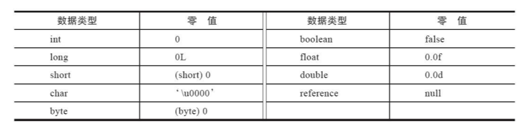

# class 初始化过程

## 类加载机制

​		Java 虚拟机把描述类的数据从 Class 文件加载到内存，并对数据进行校验、转换解析和初始化，最终形成可以被虚拟机直接使用的 Java 类型，这个过程被称作虚拟机类加载机制。

## 类加载时机

​		一个类从被加载到虚拟机内存中开始，到卸载出内存为止，它的整个生命周期将会经历：**加载**（Loading）、**验证**（Verification）、**准备**（Preparation）、**解析**（Resolution）、**初始化**（Initialization）、**使用**（Using）、**卸载**（Unloading）七个阶段。

​		加载、验证、准备、初始化、卸载这五个阶段的顺序是确定的，类型的加载过程必须按照这种 **顺序按部就班地开始** ，而解析阶段则不一定；它再某些情况下可以初始化阶段之后再开始，为了支持Java语言的运行时绑定特征（也称为动态绑定或晚期绑定）。

​		这里指按部就班地 “开始” ，而不是按部就班的 “进行” 或按部就班的 “完成” 。这点是因为这些阶段通常都是互相交叉地混合进行地，会在一个阶段执行的过程中调用、激活另一个阶段。

## 初始化时机

​		关于在什么情况下需要开始加载（Loading），《Java虚拟机规范》并没有进行强制约束，这点可以交给虚拟机实现自由把握。但对于**初始化阶段**，《Java虚拟机规范》严格规定了有且只有**六种**情况必须**立即**对类进行“初始化”（而加载、验证、准备自然需要在此之前开始）。

1. 遇到 new、getstatic、putstatic、invokestatic 这四条字节码指令时，如果**类型没有进行过初始化，则需要先触发其初始化阶段**。
   - 使用 new 关键字初始化对象的时候。
   - 读取或设置一个类型的静态字段（被final修饰、已在编译期把结果放入常量池的静态字段除外）的时候。
   - 调用一个类的静态方法的时候。
2. 使用java.lang.reflect包的方法对类型进行反射调用的时候，如果类型没有进行过初始化，则需要先触发其初始化。
3. 当初始化类的时候，如果发现其**父类还没有进行过初始化，则需要先触发其父类的初始化**。
4. 当虚拟机启动时，用户需要指定一个要执行的**主类**（包含main()方法的那个类），虚拟机会先初始化这个主类。
5. 当使用 JDK 7 新加入的动态语言支持时，如果一个 java.lang.invoke.MethodHandle 实例最后的解析结果为 REF_getStatic、 REF_putStatic、 REF_invokeStatic、 REF_newInvokeSpecial 四种类型的方法句柄，并且这个方法句柄对应的类没有进行过初始化，则需要先触发其初始化。
6. 当一个接口中定义了 JDK 8新加入的默认方法（被default关键字修饰的接口方法）时，如果有这个接口的实现类发生了初始化，那该接口要在其之前被初始化。

#### 被动引用

1. 当子类引父类静态字段，不会导致子类初始化。
2. 通过数组定义来引用类，不会触发此类的初始化。
3. 常量在编译阶段会存入调用类的常量池中，本质上没有直接引用到定义常量的类，因此不会触发定义常量的类的初始化。

## 类加载过程

### 加载

加载（Loading）阶段是整个“类加载”（Class Loading）过程中的一个阶段。加载阶段，Java虚拟机需要完成一下三件事情：

1. 通过一个类的全限定名来**获取定义此类的二进制字节流**。
2. 将这个字节流所代表的**静态存储结构转化为方法区的运行时的数据结构**。
3. 在内存中生成一个代表这个类的 java.lang.Class 对象，作为方法区这个类的各种数据的访问入口。

### 验证

​		验证是连接阶段的第一步，目的是确保Class文件的字节流中包含的信息符合《Java虚拟机规范》的全部约束要求，保证这些信息被当作代码运行后不会危害虚拟机自身的安全。

验证阶段大致上会完成下面四个阶段的检验动作：**文件格式验证**、**元数据验证**、**字节码验证**和**符号引用验证**。

1. **文件格式验证**：第一阶段要验证字节流是否符合 Class 文件格式的规范，并且能被当前版本的虚拟机处理。

   - 是否以魔数开头。
   - 主次版本号是否在当前 java 虚拟机接受范围之内。
   - 常量池的常量中是否有不被支持的常量类型。。。。。。。

2. **元数据验证**：**对字节码描述的信息进行语义分析**，保证其描述的信息符合《Java语言规范》的要求

   - 这个类是否有父类。

   - 这个类的父类是否继承了不允许被继承的类（被final修饰的类）。

   - 如果这个类不是抽象类，是否实现类其父类或接口之中要求实现的所有方法

   - 。。。。。。。

3. **字节码验证**：最复杂的一个阶段，主要目的是**通过数据流分析和控制流分析，确定程序语义是合法的、符合逻辑的**。第二阶段校验完毕以后，这阶段就**要对类的方法体进行校验分析**。

   - 保证被校验类的方法在运行时不会做出危害虚拟机安全的行为。

   - 保证任意时刻操作数栈的数据类型于指令代码序列都能配合工作。
   - 保证任何跳转指令都不会跳转到方法体外的字节码指令上
   - 。。。。。。。

4. **符号引用验证**：最后一个阶段的校验行为**发生在虚拟机将符号引用转化为直接引用的时候**，这个转化动作将在连接的第三阶段——解析阶段中发生。

   - 符号引用验证可以看作是对类自身以外（常量池中的各种符号引用）的各类信息进行匹配性校验，通俗来说就是，该类是否缺少或者被禁止访问它依赖的某些外部类、方法、字段等资源。

   - 符号引用中通过字符串的全限定名是否能找到对应的类。在指定类中是否存在符合方法的字段描述符及简单名称所描述的方法和字段。
   - 符号引用中的类、字段、方法的可访问性（private、protected、public、<package>）是否可被当前类访问
   - 。。。。。。。

### 准备

​		准备阶段是正式为类中定义的变量（即静态变量， 被static修饰的变量） 分配内存并设置类变量初始值的阶段。

​		这时候进行内存分配的仅包括类变量，而不包括实例变量，实例变量将会在对象实例化时随着对象一起分配在Java堆中。

基本数据类型的零值：

### 解析

解析阶段是 Java 虚拟机将常量池内的符号引用替换为直接引用的过程。

**符号引用与直接引用**：

- **符号引用**： 符号引用以一组符号来描述所引用的目标， 符号可以是任何形式的字面量， 只要使用时能无歧义地定位到目标即可。 符号引用与虚拟机实现的内存布局无关， 引用的目标并不一定是已经加载到虚拟机内存当中的内容。 各种虚拟机实现的内存布局可以各不相同，但是它们能接受的符号引用必须都是一致的， 因为符号引用的字面量形式明确定义在《Java虚拟机规范》 的Class文件格式中。
- **直接引用**： 直接引用是可以直接指向目标的指针、 相对偏移量或者是一个能间接定位到目标的句柄。 直接引用是和虚拟机实现的内存布局直接相关的， 同一个符号引用在不同虚拟机实例上翻译出来的直接引用一般不会相同。 如果**有了直接引用， 那引用的目标必定已经在虚拟机的内存中存在**。

### 初始化

​		类的初始化阶段是类加载过程的最后一个步骤， 之前介绍的几个类加载的动作里， 除了在加载阶段用户应用程序可以通过自定义类加载器的方式局部参与外， 其余动作都完全由Java虚拟机来主导控制。 直到初始化阶段， Java虚拟机才真正开始执行类中编写的Java程序代码， 将主导权移交给应用程序。
 		在准备阶段时，变量已经赋过一次系统要求的初始零指，而在初始化阶段，则会根据程序员通过程序编码指定的主观计划去初始化类变量和其他资源。  

​		初始化阶段就是执行类构造器<clinit>()方法的过程。<clinit>()并不是程序员在Java代码中直接编写的方法，它时 Javac 编译器的自动生成物。
​		父类的<clinit>()方法先执行，意味着父类中定义的静态语句块要优先于子类的变量赋值操作。