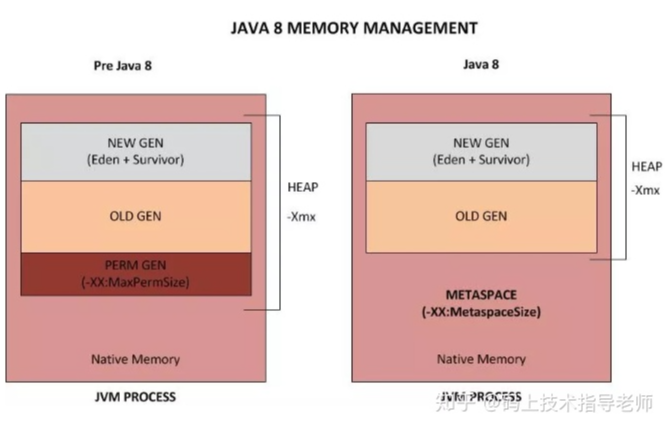

## 方法区的变化

**永久代**：

​		很多都愿意将方法区称作永久代。本质上来说并不等价，因为 HotSpot 将 GC 分代扩展至方法去，或者说用永久代来实现方法去，在其他虚拟机上是没有永久代的概念的。也就是说方法区是规范，永久代是 HotSpot 针对方法区进行的实现。

​		java 7 及以前的版本的 HotSpot 中方法区位于永久代中，同时，永久代和堆是相互隔离的，但他们使用的物理内存是连续的。

​		永久代的垃圾收集是和老年代捆绑在一起的，因此无论谁满了，都会触发永久代和老年代的垃圾收集。

在 java7 中永久代中的存储的部分数据已经开始转移到 **Java heap** 或 **native memory** 中了。

- 符号引用（Symbols）转移到了 native memory。
- 字符串常量池（interned strings）转移到了 java heap。
- 类的静态变量（class statics）转移到了 java heap。

在 java8 中。时代变了，**hotspot 取消了永久代**。永久代的参数 **-XX:PermSize 和 -XX:MaxPermSize 也随之失效**。

## 元空间（MetaSpace）

​		对于 Java8，HotSpots 取消了永久代。方法区只是一个规范，只不过它的实现变了。

​		在 Java8 中，元空间（Metaspace）登上舞台，方法区存在于元空间。同时，**元空间不再与堆连续**，而是存在于本地内存（Native memory）。

> **本地内存（Native memory）**：也成为 C-Heap，是供 jvm 自身进程使用的。当 java heap 空间不足时会触发 GC，但 native memory 空间不够却不会触发 GC。

​		元空间存在于本地内存，意味着只要本地内存足够。它不会出现像永久代中  `java.lang.OutOfMemoryError:PermGen space` 这种错误。

默认情况下元空间时可以无限使用本地内存的，但为了不让它如此膨胀，jvm提供了参数来限制它使用的使用。

- **-XX:MetaspaceSize**：class metadata 的初始空间配额，以 bytes 为单位，达到该值就会触发垃圾收集进行类型卸载，同时 GC 会对该值进行调整：如果释放了大量的空间，就适当的降低该值：如果释放了很少的空间，那么在不超过 MaxMetaspaceSize（如果设置了） ，适当的提高了该值。
- **-XX:MaxMetaspaceSize**：可以为 class metadata 分配的最大空间，默认没有限制。
- **-XX:MinMetaspaceFreeRatio**：在 GC 之后，最小的 Metaspace 剩余空间容量的百分比，减少为 class metadata 分配空间导致的垃圾收集。
- **-XX:MaxMetaspaceFreeRadio**：在 GC 之后，最大的 Metaspace 剩余空间容量的百分比，减少为 class metadata 释放空间导致的垃圾收集。

## 为什么使用元空间替换永久代

​		表面上时为了避免 OOM 异常。

​		当使用元空间时，可以加载多少类的元数据不再由 MaxPermSize 控制，而是由系统的实际可用空间来控制。

​		更深层的原因还是要合并 HotSpot 和 JRockit 的代码，JRockit 从来没有所谓的永久代，也不需要开发运维人员设置永久代的大小，但是运行良好。同时也不用担心运行性能问题了,在覆盖到的测试中, 程序启动和运行速度降低不超过1%，但是这点性能损失换来了更大的安全保障。

