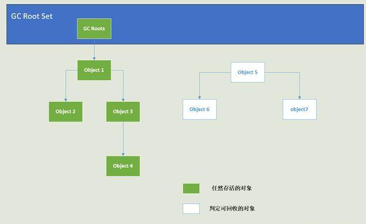
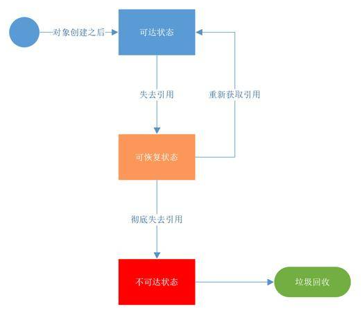
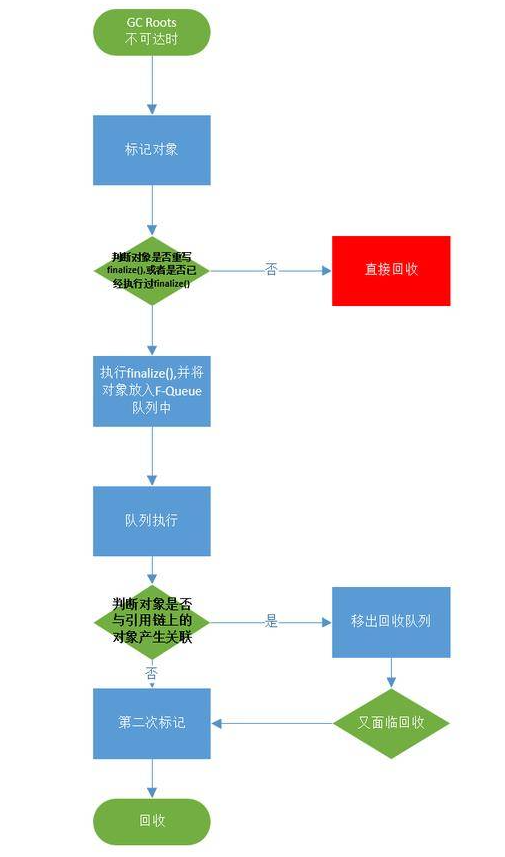

# jvm 内存回收、算法

## 触发垃圾回收

- 当 Edem 区和 from survivor 区满时。
- 调用 System.gc() 时，系统建议执行 Full GC，但是不必然执行。
- 老年代空间不足。
- 方法区空间不足。
- 通过Minor GC 后进入老年代的平均大小大于老年代的可用内存
- 由 Eden 区、From Space 区向 To Space 区复制时，对象大小大于 To Space 可用内存，则把该对象转存到老年代，且老年代的可用内存小于该对象大小。

## jvm回收算法

#### 引用计数算法

​		java 对象判断存活的方式是计算该对象的引用计数器是否为 0，如果为 0 就说明没有其他变量引用该对象了，这个对象就可以被垃圾收集器回收了。但事实上 jvm 并不是采用该算法来判断对象是否可以回收的，比如 objectA.a=objectB 及 objectB.b=objectA 除此之外没有其他引用了。但是按照引用计数算法是不会回收这两个对象的。但是这两个对象也已经不能被其他对象访问了，所以这就是问题。

#### 可达性分析算法

java 中判断是否可以回收是通过可达性分析算法来实现的。

可以作为 GC root 对象的有如下几种：

- 虚拟机栈（本地变量表）中引用的对象。
- 方法区中类静态属性引用的对象。
- 方法区中常量引用的对象。
- 本地方法栈中 JNI （一般说的 native 方法）引用的对象。

### 对象引用分类

​		判断对象是否存活我们是通过 GC Roots 的引用可达性来判断的，但是引用关系并不止一种，而是有四种分别是：强引用(Strong Reference)，软引用(Soft Reference)，弱引用(Weak Reference)和 虚引用(Phantom Reference)。引用强度依次减弱。

- **强引用**：如果一个对象具备强引用，垃圾回收器绝不会回收它。当内存空间不足，jvm 宁愿抛出 `OutOfMemoryError` 错误，使程序异常终止，也不会出现回收具有强引用的对象来解决内存不足的情况。
- **软引用**：对于软引用关联着的对象，在 jvm 应用即将发生内存溢出异常之前，将会把这些软引用关联的对象列进去回收对象范围之中进行第二次回收。如果这次回收之后还是没有足够的内存，才会抛出内存溢出异常。
- **弱引用**：被弱引用关联的对象只能生存到下一次垃圾收集发生之前，简言之就是：一旦发生 GC 必定回收被弱引用关联的对象，不管当前的内存是否足够。也就是弱引用只能活到下次 GC 之时。
- **虚引用**：一个对象是否关联到虚引用，完全不会影响该对象的生命周期，也无法通过虚引用来获取一个对象的实例(`PhantomReference`覆盖了`Reference#get()`并且总是返回null)。为对象设置一个虚引用的唯一目的是：能在此对象被垃圾收集器回收的时候收到一个**系统通知**。

### finalize 方法

​		当一个对象在堆内存中运行时，根据它被引用变量所引用的状态，可以把它所处的状态

- **可达状态**：当一个对象被创建后，若有一个以上的引用变量引用他，则这个对象在程序中处于可达状态。
- **可恢复状态**：如果程序中某个对象不再有任何引用变量引用它，它就进入了**可恢复状态**。此时，系统的垃圾回收机制准备回收该对象所占用的内存，在回收该对象之前，系统会调用所有可恢复状态对象的 **`finalize()`** 方法进行资源清理。如果系统在调用 finalize() 方法时重新让一个引用变量引用该对象，则这个对象会**再次变成可达状态**；**否则该对象将进入不可达状态**。
- **不可达状态**：当对象与所有引用变量的关联都被切断，且系统已经调用所有对象的 finalize() 方法后依然没有使该对象变成可达状态，那么这个对象将永久性地失去引用，最后变成不可达状态。只有当一个对象处于不可达状态时，系统才会真正回收该对象所占有的资源。

**所以 finalize 方法只对象存活的最后一次机会，而且只会执行一次。**

销毁一个对象过程归纳如下：

### 方法区的回收

永久代的垃圾收集主要回收两部分内容：废弃常量和无用的类。

​		回收废弃常量与回收Java堆中的对象非常类似。以常量池中字面量的回收为例，假如一个字符串 “abc” 已经进入了常量池中，但是当前系统没有任何一个 String 对象是叫做 “abc” 的，换句话说是没有任何 String 对象引用常量池中的 “abc” 常量，也没有其他地方引用了这个字面量，如果在这时候发生内存回收，而且必要的话，这个 “abc” 常量就会被系统 “请” 出常量池。常量池中的其他类（接口）、方法、字段的符号引用也与此类似。

判断一个常量是否是 “废弃常量” 比较简单，而要判定一个类是否是 “无用的类” 的条件则相对苛刻。

类需要同时满足下面 3 个条件才能算是 “无用的类”：

- 该类所有的实例都已经被回收，也就是 java 堆中不存在该类的任何实例。
- 加载该类的 ClassLoader 已经被回收。
- 该类对应的 java.lang.Class 对象没有在任何地方被引用，无法在任何地方通过反射访问该类的方法。

​		虚拟机可以对满足上述3个条件的无用类进行回收，这里说的仅仅是“可以”，而不是和对象一样，不使用了就必然会回收。是否对类进行回收，HotSpot虚拟机提供了-Xnoclassgc参数进行控制，还可以使用-verbose:class及-XX:+TraceClassLoading、 -XX:+TraceClassUnLoading查看类的加载和卸载信息。

---

## 垃圾回收算法

#### 垃圾回收解决的问题

1. 开发者可能过早的回收依然在引用的对象，这种情况将引发悬挂指针问题。

   

2. 开发者可能在程序将对象使用完毕之后未将对象释放，从而导致内存泄漏。

#### 垃圾回收的好处

1. 不会有二次释放的问题。

2. 降低了程序的耦合度，开发者只关注自身模块，或只关注其他相关模块的少量代码。

3. 完整性与及时性。

4. 停顿时间

   ​		许多回收器在进行垃圾回收时需要中断赋值器线程，因此会导致在线程执行过程中停顿，回收器应当尽量减少对程序的执行过程的影响，因此停顿时间越短越好。

5. 空间开销

---

## 4 种垃圾收集策略

### 标记-清除

​		回收器在遍历对象图之前必须先构造标记过程需要用到的起始工作列表（gc root set），即对每个根对象进行标记并将其加入工作列表，回收器可以通过标记对象头的某个位的方式对其进行标记，该位也可位于一张额外的表中。

标记-清楚要求堆满足一定的条件：

- mark-sweep 回收器不会移动对象，因此内存管理器必须能够控制堆内存碎片，因为过多的内存碎片可能会导致分配器无法满足新分配的请求，从而增加垃圾回收的频率。
- 清扫器必须能够遍历队中的每一个对象。

### 标记-复制

​		复制算法可以消除内存碎片，但需要多次遍历，copy 算法回收器在复制过程中进行堆整理，从而提升了赋值器的分配速度，但是堆的可用空间降低了一半。

​		经过整理的堆分配内存速度很快，分配过程简单。

​		copy 算法的确定就是需要维护第二个半区，在内存大小一定，半区复制算法的可用空间是整堆回收的。者导致复制试的回收器所需的回收次数要比其他回收器更多。

### 标记-整理

​		对堆中存活对象进行整理以降低内存碎片的回收策略，compact可以极为快速的顺序分配

整理算法执行要经过数个阶段：首先是**标记阶段**，**整理阶段**，即移动存活对象，同时更新存活对象中执行被移动对象对象的指针。有三种 compact 顺序。

- **任意顺序**：对象的移动方式与它们的原始排列顺序和饮用关系无关
- **线性顺序**：将具有关联关系的对象排列在一起，如具有引用关系的对象，或者统一数据结构中的相邻对象
- **滑动顺序**： 将对象滑动到堆的一顿啊，挤出垃圾，从而保证对象在堆中的原有分配顺序

> 引用：https://juejin.cn/post/6844904192058851336