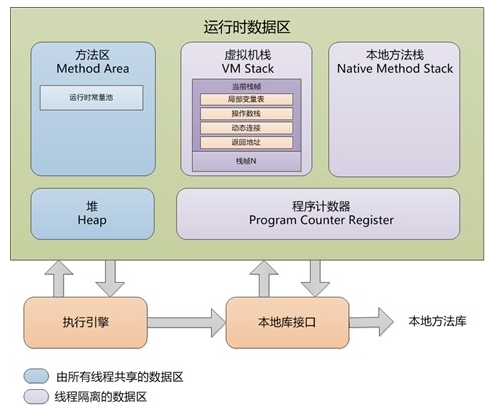
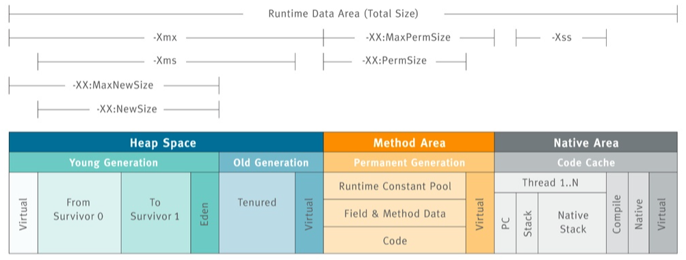
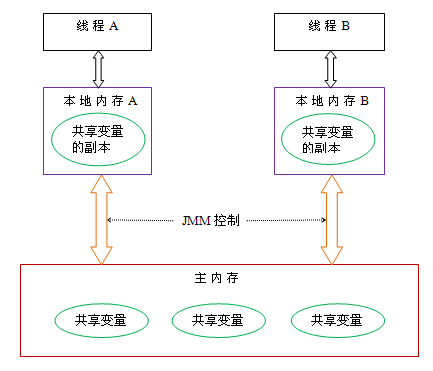
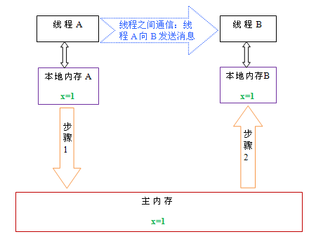

# jvm 内存模型与结构

---

## jvm内存结构

- **堆（Heap）**：线程共享。所有的对象实例以及数组都要在堆上分配。回收器主要管理的对象。
- **方法区（Method Area）**：线程共享。存储类信息、常量、静态变量、即时编译器编译后的代码。
- **方法栈（JVM Stack）**：线程私有。存储局部变量表、操作栈、动态链接、方法出口，对象指针。
- **本地方法栈（Native Method Stack）**：线程私有。为虚拟机使用到的Native 方法服务。如Java使用c或者c++编写的接口服务时，代码在此区运行。
- **程序计数器（Program Counter Register）**：线程私有。有些文章也翻译成PC寄存器（PC Register），同一个东西。它可以看作是当前线程所执行的字节码的行号指示器。指向下一条要执行的指令。

#### 堆（Heap）

​		存放对象实例和数组。可以分为新生代和老年代。新生代又可以分为 Eden 空间、From Survivor 空间（s0）、To Survivor 空间（s1）。所有新生成的对象首先都是放在新生代的。

##### 控制参数

- -Xms：设置堆的最小空间大小
- -Xmx：设置堆的最大空间大小
- -XX:NewSize：设置新生代最小空间大小
- -XX:MaxNewSize：设置新生代最大空间大小

##### 异常情况

​		此区域是垃圾回收的主要操作区域。如果在堆中没有内存完成实例分配，并且堆也无法再扩展时，将会抛出OutOfMemoryError 异常。

#### 方法区

​		是各个线程共享的内存区域。用于存储已被虚拟机加载的类信息、常量、静态变量、即时编译器编译后的代码等数据。有一个别名叫做Non-Heap（非堆）。

​		很多人愿意把方法区称为“永久代”（Permanent Generation），本质上两者并不等价，使用永久代来实现方法区而已。

​		对此区域会涉及但是**很少进行垃圾回收**。这个区域的内存回收目标主要是针对**常量池的回收**和对类**型的卸载**，一般来说这个区域的回收“成绩”比较难以令人满意。

##### 控制参数

- -XX:PermSize：设置最小空间
- -XX:MaxPermSize：设置最大空间

##### 异常情况

​		对此区域会涉及但是**很少进行垃圾回收**。这个区域的内存回收目标主要是针对常量池的回收和对类型的卸载，一般来说这个区域的回收“成绩”比较难以令人满意。

#### 方法栈

​		每个线程会有一个私有的栈。每个线程中方法的调用又会在本栈中创建一个**栈帧**。方法栈中会存放编译期可知的各种**基本数据类型**（boolean、byte、char、short、int、float、long、double）、**对象引用**（reference 类型，它不等同于对象本身。局部变量表所需的内存空间**在编译期间完成分配**，当进入一个方法时，这个方法需要在帧中分配多大的**局部变量空间是完全确定的**，在方法运行期间不会改变局部变量表的大小。

##### 控制参数

- -Xss：控制每个线程栈的大小

##### 异常情况

- StackOverflowError： 异常线程请求的栈深度大于虚拟机所允许的深度时抛出。
- OutOfMemoryError 异常： 虚拟机栈可以动态扩展，当扩展时无法申请到足够的内存时会抛出。

#### 本地方法栈

​		本地方法栈（Native Method Stacks）与虚拟机栈所发挥的作用是非常相似的，其区别不过是虚拟机栈为虚拟机执行Java 方法（也就是字节码）服务，而本地方法栈则是为虚拟机使用到的 native 方法服务。

##### 控制参数

​		在Sun JDK中本地方法栈和方法栈是同一个，因此也可以用-Xss控制每个线程的大小。

##### 异常情况

​		与虚拟机栈一样，本地方法栈区域也会抛出StackOverflowError 和OutOfMemoryError

异常。

#### 程序计数器

​		可以看做是当前线程所执行的字节码的行号指示器。

##### 异常情况

​		此内存区域是唯一一个在Java 虚拟机规范中没有规定任何 OutOfMemoryError 情况的区域。

---

## jvm内存模型

​		堆和方法区是线程共享的。而局部变量，方法定义参数和异常处理器参数就不会在线程之间共享，它们不会有内存可见性问题，也不受内存模型的影响。

​		Java线程之间的通信由Java内存模型（本文简称为JMM）控制，JMM决定一个线程对共享变量的写入何时对另一个线程可见。从抽象的角度来看，JMM定义了线程和主内存之间的抽象关系：线程之间的**共享变量存储在主内存**（main memory）中，每个**线程都有一个私有的本地内存**（local memory），**本地内存中存储了该线程以读/写共享变量的副本**。本地内存是JMM的一个抽象概念，并不真实存在。它涵盖了缓存，写缓冲区，寄存器以及其他的硬件和编译器优化。

如果线程A 与线程B 之间如要通信的话，要经历下面两个步骤：

1. 线程A 把本地内存A 中更新过的共享变量刷新到主内存中去。
2. 线程B 到主内存中去读取 线程A 之前已经更新过的共享变量。

#### 重排序

在执行程序时为了提高性能，编译器和处理器常常会对指令做重排序。

重排序可以发生在好几个地方：**编译器**、**运行时**、**JIT** 等。。。

比如编译器会觉得把一个变量的写操作放在最后会更有效率，编译后，这个指令就在最后了（前提是只要不改变程序的语义，编译器、执行器就可以这样自由的随意优化），一旦编译器对某个变量的写操作进行优化（放到最后），那么在执行之前，另一个线程将不会看到这个执行结果。

