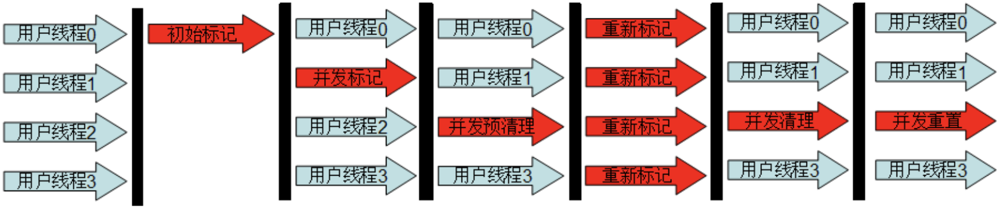
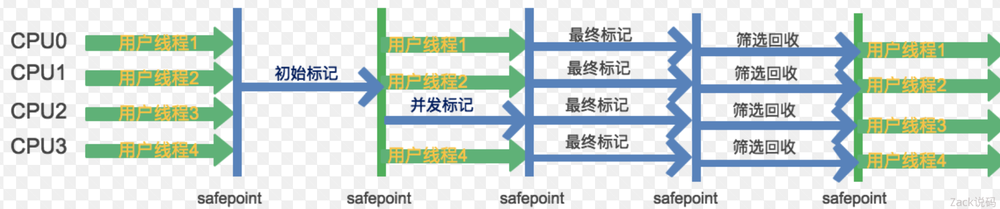

# jvm 垃圾回收器

常用的垃圾回收器

**Serial、ParNew、Parallel Scavenge 用于新生代。**

**CMS、Serial Old、Paralled Old 用于老年代。**

​		他们相互之间以相对固定的组合使用。

**G1 是一个独立的收集器不依赖其他 6 中收集器。**

**ZGC 是目前 jdk 11 的实验收集器。**

## Serial

单线程执行垃圾回收，当需要执行垃圾回收时，程序会暂停一切受伤的工作，然后单线程执行垃圾回收。

因为新生代的特点是**对象存活率低**，所以收集算法用的是**复制算法**。把新生代存活对象复制到老年代，复制的内容不多，性能较好。

##### 好处

- 减少上下文切换，减少系统资源的开销。

##### 缺点

- GC 过程中，会暂停程序的执行。若 GC 不频繁发生，或许是一个不粗哦的选择，否则将会影响程序的执行性能。对于新生等待来说，区域比较小，停顿时间段，所以比较适用。

## ParNew

同样用于新生代，是 **Serial 的多线程版本**，并且在参数，算法上也完全和 Serial 相同。

Par 是 Parallel 的缩写，但他的**并行仅仅指的是收集多线程执行**，并不是收集和源程序可以并行进行。ParNew 也是需要暂停程序一切的工作，然后多线程执行垃圾回收。

因为多线程执行所以在多CPU下，ParNew 效果通常会比 Serial 好。但如果是单 CPU 则会因为线程的切换，性能反而更差。

## Parallel Scavenge

新生代收集器，同样用的复制算法。也是并行多线程收集。它关注的是垃圾回收的吞吐量。

- **吞吐量： **

  指 总时间 与 垃圾回收时间的比例。这个比例越高，证明垃圾回收占整个程序运行的比例越小。

##### 参数

- **-XX:MaxGCPauseMillis**：最大垃圾回收停顿时间。这个参数的原理是空间换时间，收集器会控制新生代的区域大小，从而尽可能保证回收少于这个最大停顿时间。简单得说就是回收的区域越小，那么耗费的时间也越小。

  如果这个参数设太小，新生代空间会太小，从而更频繁的触发 GC。

- **-XX:GCTimeRatio**，垃圾回收时间与总时间占比。这个是吞吐量的倒数，原理和 MaxGCPauseMillis 相同。

## Serial Old

老年代收集器，与 Serial 一样是**单线程**，不同的是算法用 **标记-整理**。

因为老年代里对象的存活率高，如果依旧是用复制算法，需要复制的内容较多，性能较差。在极端的情况下，当存活为 100% 时，没有办法用复制算法。

## Parallel Old

老年代收集器，是 Parallel Scavenge 老年代版本。收集算法为 **标记-整理**。

## CMS

Concurrent Mark Sweep，老年代收集器，它关注的是垃圾回收最短的停顿时间（低停顿），在老年代不频繁 GC 的场景下，是比较适用的。

#### 工作原理

- **初始标记：**单线程执行，需要 STW，仅仅把 GC Roots 的直接关联可达的对象给标记一下，由于直接关联对象比较小，所以这里的速度非常快。
- **并发标记：**对于初始标记过程所标记的初始标记对象，进行并发追踪标记，此时其他线程仍可以继续工作。此处工作时间较长，但不停顿。
- **重新标记：**在并发标记的过程中，由于可能还会产生新的垃圾，所以此时需要重新标记新产生的垃圾。此处执行并行标记，与用户线程不并发，STW。时间比初始时间要长一点。
- **并发清除：**并发清除之前所标记的垃圾。其他用户线程仍可以工作，不需要停顿。

由于最耗费时间的并发标记与并发清除阶段都不需要暂停工作，所以整体的回收是低停顿的。

#### 缺点

- 标记-清除 会导致内存碎片比较多。
- CMS 的并发能力依赖于 CPU 资源，所以在 CPU 数少和 CPU 资源紧张的情况下，性能较差。
- 并发清除阶段，用户线程依然在运行，所以依然会产生新的垃圾，此阶段的垃圾并不会在本次 GC 中回收，而放到下次。所以 GC 不能等待到内存耗尽的时候才进行 GC，这样的话会导致并发清除的时候，用户线程可以利用的空间不足。所以这里会浪费一些内存空间给用户线程预留。

## G1

Garbage First，jdk1.7 正式启用。解决了 CMS 内存碎片、更多的内存空闲等问题。

**高效益优先：**G1 会预测垃圾回收的停顿时间，原理是计算老年代对象的效益率，优先回收最大效益的对象。

**堆内存结构的不同：**G1 把内存非为多个大小相同的区域 Region，每个 Region 拥有各自的分代属性，但这些分代不需要连续。

G1 对于每个 Region 都维护一个 Remembered Set，用于记录对象引用的情况。当 GC 发生的时候根据 Remembered Set 的引用情况去搜索。

#### 两种 GC 模式

- **YGC**：关注所有年轻代的 Region，通过控制收集年轻代的 Region 个数，从而控制 GC 的回收时间。
- **Mixed GC**：关注于所有年轻代的 Region，并且加上通过预测计算最大收益的若干个老年代 Region。

#### 整体执行流程

- **初始标记**：标记了从 GC root 开始直接关联可达的对象。**STW**。
- **并发标记**：并发标记初始标记的对象，此时用户线程依然可以执行。
- **最终标记**：**STW**，标记再并发标记过程中产生的垃圾。
- **筛选回收**：评估标记垃圾，根据 GC 模式回收垃圾。 **STW** 执行。

> 引用：https://juejin.cn/post/6844903894196158471

## ZGC

回收耗时平均不到 2 毫秒，是一款低停顿高并发的收集器。

ZGC 几乎再所有地方并发执行的，除了初始标记的是 STW 的。所以停顿时间几乎就耗费在初始标记上，这部分的实际是非常少的。

ZGC 主要新增了两项计数，一个是 **着色指针**，另一个是 **读屏障**。

#### 着色指针（Colored Pointer）

​		ZGC利用指针的64位中的几位表示 Finalizable、Remapped、Marked1、Marked0（ZGC仅支持64位平台），以标记该指向内存的存储状态。相当于在对象的指针上标注了对象的信息。

在这个被指向的内存发生变化的时候，颜色就会发生变化。

#### 读屏障（Load Barrier）

​		由于着色指针的存在，在程序运行时访问对象的时候，可以轻易知道对象在内存的存储状态，若请求读的内存在被着色了。那么则会触发读屏障。读屏障会更新指针再返回结果，此过程有一定的耗费，从而达到与用户线程并发的效果。

> https://tech.meituan.com/2020/08/06/new-zgc-practice-in-meituan.html

