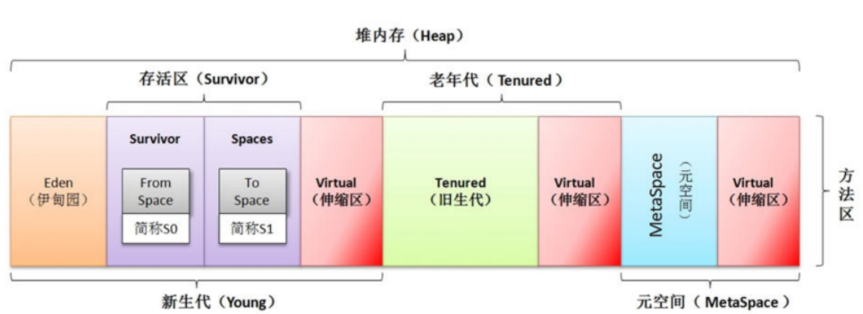

# jvm 堆

## 新生代

我们在方法中区new一个对象，那这方法调用完毕后，对象就会被回收，这就是一个典型的新生代对象。

​		新生代中的对象98%都是朝生夕死的。并不需要按照 1:1 的比例来划分内存空间，而是将内存分为一块比较大的 eden 空间和两块比较小的 survivor 空间，每次使用 eden 和其中一块 survivor。

​		每次清理，将 eden 和 survivor 中还存活的对象一次性复制到另一块 survivor 空间中，最后清理掉刚才的 eden 和 survivor 空间。HotSpot虚拟机默认 eden 和 survivor 的大小比例是 8:1。

​		98% 的对象可回收只是一般场景下的数据，我们没有办法保证每次回收都只有不多于 10% 的对象存活，当 survivor 空间不够用时，需要依赖于老年代进行分配担保，所以大对象直接进入老年代。同时，长期存活的对象将进入老年代（虚拟机给每隔对象定义一个年龄计数器）。

**jdk 1.8 后，将最初的永久代内存空间取消了。变成了原空间（堆外）。**

**取消永久代的目的是为了将 HotSpot 与 JRockit 两个虚拟机标准联合为一个。**

---

## 老年代

​		老年代主要存放的是经历过几次垃圾回收之后还存活的对象，刚刚在说到新生代对象的复制转移的时候，当被标记了 16 次的对象如果还存活着，就会被送入到老年代。

**另外一种就是较大的对象，较大的对象也就被直接送入到老年代中。**

---

## 永久代（元空间）

​		JDK1.8之前叫永久代，像一些方法中的操作临时对象等，JDK1.8之前是占用JVM内存，JDK1.8之后直接使用物理内存 。

## 堆内存空间调整参数

- -Xms：设置初始分配大小，默认为物理内存的1/64 

- -Xmx：最大分配内存，默认为物理内存的1/4

- -XX:+PrintGCDetails：输出详细的GC处理日志 

- -XX:+PrintGCTimeStamps：输出GC的时间戳信息 

- -XX:+PrintGCDateStamps：输出GC的时间戳信息（以日期的形式）

- -XX:+PrintHeapAtGC：在GC进行处理的前后打印堆内存信息 

- -Xloggc:(SavePath)：设置日志信息保存文件 

- 在堆内存的调整策略中，基本上只要调整两个参数：-Xms和-Xmx 