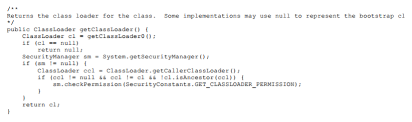

## 类与类加载器

​		把类加载阶段中的 “通过一个类的全限定名来获取描述该类的二进制字节流” 这个动作放到Java虚拟机外部去实现， 以便让应用程序自己决定如何去获取所需的类。 实现这个动作的代码被称为“**类加载器**”（Class Loader） 。

​		类加载器虽然只用于实现类的加载动作， 但它在Java程序中起到的作用却远超类加载阶段。 对于任意一个类， 都必须由加载它的类加载器和这个类本身一起共同确立其**在Java虚拟机中的唯一性**， 每一个类加载器， 都**拥有一个独立的类名称空间**。 这句话可以表达得更通俗一些： 比较两个类是否“相等”， 只有在这两个类是由同一个类加载器加载的前提下才有意义， 否则， 即使这两个类来源于同一个Class文件， 被同一个Java虚拟机加载， 只要加载**它们的类加载器不同， 那这两个类就必定不相等**。

   这里所指的“**相等**”， 包括代表类的Class对象的**equals()**方法、 **isAssignableFrom()**方法、 **isInstance()**方法的返回结果， 也包括了使用 instanceof 关键字做对象所属关系判定等各种情况。 如果没有注意到类加载器的影响， 在某些情况下可能会产生具有迷惑性的结果。

## 双亲委派模型

站在 jvm 的角度来看，只存在两种不同的类加载器。

- 一种是 **启动类加载器（BootstrapClassLoader）**：这个类加载器使用 C++ 语言实现。是虚拟机自身的一部分。
- 另一种就是 **其他所有的类加载器**，这些加载器都由 java 语言实现，独立于虚拟机外部，并且全部继承自抽象类 java.lang.ClassLoader。

#### 启动类加载器（Bootstrap Class Loader）

​		负责加载存放在**<JAVA_HOME>\lib**目录，或者被**-Xbootclasspath参数所指定得路径**中存放的，而且是Java虚拟机能够识别得类库加载到虚拟机得内存中。启动类加载器无法被Java程序直接引用，在编写自定义类加载器时，如果需要把加载请求委派给引导类加载器去处理，直接使用 null 即可。

#### 扩展类加载器（Extension Class Loader）

​		这个类加载器是在类 sun.misc.Launcher$ExtClassLoader 中以Java代码的形式实现的。它负责加载 **<JAVA_HOME>\lib\ext** 目录中， 或者被 **java.ext.dirs** 系统变量所指定的路径中所有的类库。

​		这是一种Java系统类库的扩展机制， JDK 的开发团队允许用户将具有通用性的类库放置在ext目录里以扩展 Java SE 的功能， 在 jdk9 之后， 这种扩展机制被模块化带来的天然的扩展能力所取代。 由于扩展类加载器是由Java代码实现的， 开发者可以直接在程序中使用扩展类加载器来加载 Class 文件。

#### 应用程序类加载器（Application Class Loader）

​		这个类加载器由 sun.misc.Launcher$AppClassLoader 来实现。 由于应用程序类加载器是ClassLoader类中的 getSystemClassLoader() 方法的返回值， 所以有些场合中也称它为“**系统类加载器**”。 它负责加载用户类路径（ClassPath） 上所有的类库， 开发者同样可以直接在代码中使用这个类加载器。 如果应用程序中没有自定义过自己的类加载器， 一般情况下这个就是程序中**默认的类加载器**。

各种类加载器之间的层次关系被成为类加载器的“**双亲委派模型**”（Parents Delegation Model）。

双亲委派模型要求除了顶层的启动类加载器外，**其余的类加载器都应有自己的父类加载器**。这里类加载器之间的父子关系一般不是以继承的关系来实现的，而是通常使用**组合**（Composition）关系来**复用**父加载器的代码。

##### 双亲委派模型工作过程

- 如果一个类加载器收到了类加载的请求， 它首先不会自己去尝试加载这个类， 而是**把这个请求委派给父类加载器**去完成。
- 每一个层次的类加载器都是如此， 因此所有的加载请求最终都应该传送到最顶层的启动类加载器中， 只有**当父加载器反馈自己无法完成这个加载请求**（它的搜索范围中没有找到所需的类） 时， **子加载器才会尝试自己去完成加载**。

## 破坏双亲委派模型

双亲委派模型并不是一个具有强制性的约束的模型，而是Java设计者推荐给开发者们的类加载器实现方式。

**线程上下文类加载器**（Thread Context ClassLoader）：这个类加载器可以通过 java.lang.Thread 类的 setContext-ClassLoader() 方法进行设置，如果创建线程时还未设置，它将会从父线程中继承一个，如果在应用程序的全局范围内都没有设置过的话，哪这个类加载器默认就是应用程序类加载器。