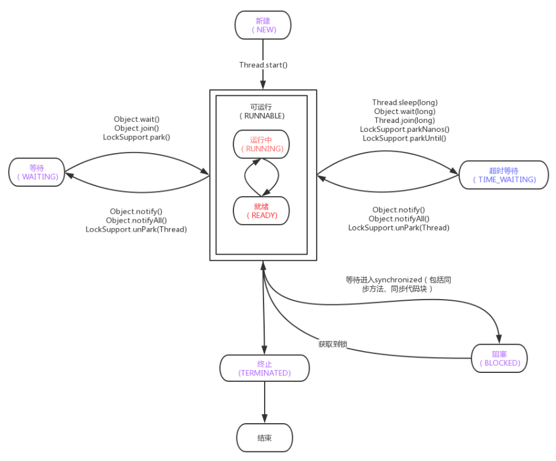
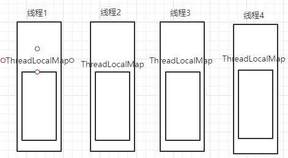

## 进程

每一个应用都有一个或多个进程，进程帮助我们隔离了不同的资源。

进程是资源分配的最小单位。


## 线程

​		每个进程都至少需要一个线程作为执行单位，同时可以开启新的线程执行。一个 CPU 核心 一个时刻只能运行一个线程，多个线程之间需要不断进行调度。

因此，线程是 CPU 调度的最小单位。


> https://juejin.cn/post/6844903779536633864#heading-5


## 创建线程的方式


## 线程的状态

java 线程有以下 5 中状态。

|   线程状态    |                             含义                             |
| :-----------: | :----------------------------------------------------------: |
|      NEW      |       新建状态，线程已经创建，但是没有执行start()方法        |
|   RUNNABLE    |  可运行状态，线程可以在JVM中运行，但是还需要等待CPU分配资源  |
|    BLOCKED    | 阻塞状态，当遇到synchronized且没有取得相应的锁，就会进入这个状态 |
|    WAITING    | 等待状态，当线程中wait()/join/Locksupport.park方法时，就会进入这个状态 |
| TIMED_WAITING | 计时等待状态，当调用Thread.sleep()或者Object.wait(xx)或者Thread.join(xx)或者LockSupport.parkNanos或者LockSupport.partUntil时，进入该状态 |
|  TERMINATED   |    线程中断状态，线程被中断或者运行结束，就会进入这个状态    |

5 种状态对应不同的方法：



> 在上图中 `标红` 的两个状态，是操作系统中线程对应的状态，Java将这两种状态合并为 **可运行状态(RUNNABLE)**。在操作系统中 **就绪状态(READY)** 表示线程已经准备完毕，等待 CPU 分配时间片。**运行中状态(RUNNING)** 表示当线程分到时间片，线程开始正式执行。


## 线程的方法

#### Thread.sleep(1000)

让当前正在执行任务的线程睡眠（临时的停止执行）指定的毫秒数，这个精度和准确性是用系统时钟和调度器保证的。但是，线程并不会释放它拥有的锁。

#### Thread.yield()

停止当前正在执行的当前线程，并进入等待队列 running -> ready 也不会释放锁。

#### Thread.join()

在当前线程加入其他线程的 join 方法，本线程等待。等调用的线程运行结束，当前线程再继续执行。

当线程 A 调用线程 B 对象（bThread)的join方法，其含义是当前线程 A 等待线程 B 终止后，才从线程 A 中 bThread.join() 代码的调用处返回。线程除了 join 方法以外还提供了 join(long millis) 和 void join(long millis, int nanos) 这两个具备超时特性的方法。这两个方法的意义是如果在给定的时间内线程B没有终止。那么线程A将会从该方法中返回。

> join() 方法内部会调用 join(final long millis) 方法。

#### Thread.interrupt()

Thread.interrupt() 方法不会中断一个正在运行的线程。

如果一个线程处于了阻塞状态（如线程调用了 thread.sleep、thread.join、thread.wait、1.5中的 condition.await、以及可中断的通道上的 I/O 操作方法后可进入阻塞状态），则线程会一直检查中断状态表示，如果发现中断状态标识为 true，则会再这些阻塞方法（sleep、join、wait、1.5中的condition.wait及可中断的通道上的 I/O 操作方法）调用出抛出 InterruptedException 异常，并且再抛出异常后立即将线程的中断标识为清除，即重新设置为 false。抛出异常是为了线程从阻塞状态醒过来，并在结束线程前程序员有足够的时间来处理中断请求。

#### Thread.interrupted()

作用是测试当前线程是否被中断（检查中断标识），返回一个 boolean 并清除中断状态，第二次再调用时中断状态已经被清除，将返回一个 false。

#### Thread.isinterrupt()

作用是只测试此线程是否被中断，不清除中断状态。

#### Object.wait(),wait(long),wait(long,int)

将当前线程置为等待 blocked 阻塞状态，也就是 ObjectMonitor 底层实现的 WaitSet 中。在调用 wait() 方法前，线程必须获得该对象的锁，并且只能在同步方法或者同步代码块中调用 wait() 方法。

如果在等待线程接到通知或被中断之前，已经超过了指定的毫秒数，则它通过竞争重新获得锁，并从 wait(long) 返回。

#### Object.notify(),notifyAll()

在线程中调用 notify() 和 notifyAll() 方法，将通知其他线程从wait（）方法处返回。当有线程调用了对象的notifyAll() 方法（唤醒所有wait线程）或notify() 方法（只随机唤醒一个wait线程），被唤醒的的线程便会进入该对象的锁池中 (EntryList )，锁池中的线程会去竞争该对象锁

Object是所有类的超类，所有的类都是Object继承而来。这五个方法都被声明为final，因此子类中不能复写任何一个方法


## ThreadLocal

`ThreadLocal `类是一个线程数据绑定类。

所有线程共享，但读取其中数据时又只能是获取线程自己的数据, 写入也只能给线程自己的数据。


### 源码分析

```java
public T get () {
    // 获取当前线程
    Thread t = Thread.currentThread();
    // 获取 ThreadLocalMap
    ThreadLocal.ThreadLocalMap map = getMap(t);
    // map不为null
	if (map != null) {
		// 根据this获取我们的entry
		ThreadLocal.ThreadLocalMap.Entry e = map.getEntry(this);
		if (e != null) {
			@SuppressWarnings("unchecked")
			T result = (T)e.value;
			return result;
		}
	}
	// 如果map获取为空, 则初始化
	return setInitialValue();
}
```

`ThreadLocal` 底层使用的不是类似 `Map<Thread, Data>` 这种结构而是




> 引用：https://juejin.cn/post/6844904201227599879


### 总结

​		每个线程都有一个属于自己的 `ThreadLocalMap` 类, 他用于关联多个以 `ThreadLocal` 对象为 `key`, 以`你的数据` 为` value`的` Entry `对象, 且该对象的`key`是一个`弱引用对象`。

### Entry

它继承了弱引用类 **WeakReference**

```java
static class Entry extends WeakReference<ThreadLocal<?>> {
    Object value;

    Entry(ThreadLocal<?> k, Object v) {
        // ThreadLocal被设置为弱引用
        super(k);
        // 保存value
        value = v;
    }
}
```


## wait 与 sleep 区别

- wait() 是 Object 中定义的 native 方法。

  ```java
  public final native void wait(long timeout) throws InterruptedException;
  ```

  每一个类的实例都可以调用这个方法。wait() 只能在 synchronized block 中调用。它会释放 synchronized 时加在 object 上的锁。

- sleep() 是定义 Thread 中的 native 静态类方法：

  ```java
  public static native void sleep(long millis) throws InterruptedException;
  ```

  Thread.sleep() 可以在任何情况下调用。Thread.sleep() 将会暂停当前线程，并且不会释放任何锁资源。

#### 唤醒 wait 和 sleep

sleep() 方法自带 sleep 时间，时间过后，Thread 会自动被唤醒。 或者可以通过调用 interrupt() 方法来中断。

wait 的唤醒会比较复杂，我们需要调用 notify() 和 notifyAll() 方法来唤醒等待在特定 wait object 上的线程。

​		notify() 会根据线程调度的机制选择一个线程来唤醒;

​		notifyAll() 会唤醒所有等待的线程，由这些线程重新争夺资源锁。


> 引用：https://juejin.cn/post/6844903919781412877