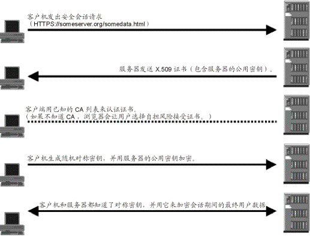

# HTTP

## 概述

### HTTP 协议

超文本传输协议（HyperText Transfer Protocol），用于从WWW服务器传输超文本到本地浏览器的传送协议。


### TCP/IP 协议

HTTP是基于TCP/IP 协议之上的。两台计算机之间的通信是通过 TCP/IP 协议在因特网上进行的。


## HTTP 原理

### 工作过程

一次 HTTP 操作称为一个事务。

1. **地址解析：**如用客户端浏览器请求这个页面，从中分解出协议名、主机名、端口、对象路径等部分。

   - 协议名：https
   - 主机名：github.com
   - 端口：“”
   - 对象路径：/7-xin/note
   - 需要域名系统 DNS 解析域名 github.com，得出主机的 IP 地址。

2. **封装 HTTP 请求数据包**

   ​		把以上部分结合本机自己的信息，封装成一个HTTP请求数据包。

3. **封装成 TCP 包，建立 TCP 连接（TCP 三次握手）**

   ​		HTTP工作开始之前，客户机（Web浏览器）首先要通过网络与服务器建立连接，该连接是通过TCP来完成的，该协议与IP协议共同构建Internet，即著名的TCP/IP协议族，因此Internet又被称作是TCP/IP网络。		HTTP是比TCP更高层次的应用层协议，根据规则，只有低层协议建立之后才能，才能进行更层协议的连接，因此，首先要建立TCP连接，一般TCP连接的端口号是80。

4. **客户机发送请求命令**

   ​		建立连接后，客户机发送一个请求给服务器，请求方式的格式为：统一资源标识符（URL）、协议版本号，后边是 MIME 信息包括请求修饰符、客户机信息和可内容。

5. **服务器响应**

   ​		服务器接到请求后，给予相应的响应信息，其格式为一个状态行，包括信息的协议版本号、一个成功或错误的代码，后边是 MIME 信息包括服务器信息、实体信息和可能的内容。

   ​		实体消息是服务器向浏览器发送头信息后，它会发送一个空白行来表示头信息的发送到此为结束，接着，它就以 Content-Type 应答头信息所描述的格式发送用户所请求的实际数据。

6. **服务器关闭 TCP 连接**

   ​		一般情况下，一旦 web 服务器向浏览器发送了请求数据，它就要关闭 TCP 连接，然后如果浏览器或者服务器在其头信息加入了这个请求头 Connection:keep-alive，TCP 连接在发送后将仍然保持打开状态，于是，浏览器可以继续通过相同的连接发送请求。保持连接节省了为每个请求建立新连接所需的时间，还节约了网络带宽。


## SSL 工作原理

​		SSL（Server socket layer）是一种保证网络两个节点进行安全通信的协议。SSL 和 TLS 建立在 TCP/IP 协议基础上。建立在 SSL 上的 HTTP 协议称为 HTTPS，默认端口 443。SSL 使用加密技术实现会话双方信息的安全传递。


### 加密类型

有两种基本的加解密算法类型：

#### 对称加密

​		密钥只有一个，加密解密为同一个密码，且加解密速度快，典型的对称加密算法有 DES、AES，RC5，3DES等。

​		对称加密主要问题是共享秘钥，除你的计算机（客户端）知道另外一台计算机（服务器）的私钥秘钥，否则无法对通信流进行加密解密。解决这个问题的方案非对称秘钥。

#### 非对称加密

​		使用两个秘钥：公共秘钥和私有秘钥。私有秘钥由一方密码保存（一般是服务器保存），另一方任何人都可以获得公共秘钥。


### 获取证书

> CA 认证过的公钥

1. **从权威机构购买证书**

   ​		安全证书由国际权威的证书机构(CA)，如 VeriSign 和 Thawte 颁发，它们保证了证书的可信性。一个安全证书只对一个 IP 有效，多个 IP 必需购买多个证书。

2. **创建自我签名的证书**

   ​		如果通信双方只关心数据在网络上的可以安全传输，并不需要对方进行身份验证，这种情况下，可以创建自多签名证书。这证书达不到身份认证的目的，但可以用于加密通信。


### SSL 握手

SSL 连接总是由客户端启动的。在SSL 会话开始时执行 SSL 握手。此握手产生会话的密码参数。




# 问题

#### 1. HTTP 状态码

- 1xx 信息
- 2xx 成功
- 3xx 重定向
- 4xx 客户端错误
- 5xx 服务器错误


#### 2. DNS解析过程

​		主机向本地域名服务器的查询一般都是递归查询。

​		**递归查询**：如果主机所询问的本地域名服务器不知道被查询的域名的 IP 地址，那么本地域名服务器就以 DNS 客户的身份，向根域名服务器继续发出查询请求报文（即替主机继续查询），而不是让主机自己进行下一步查询。因此，递归查询返回的查询结果或者是所要查询的 IP 地址，或者是报错，表示无法查询到所需的 IP 地址。

​		本地域名服务器向根域名服务器的查询的迭代查询。

​		**迭代查询的特点**：当根域名服务器收到本地域名服务器发出的迭代查询请求报文时，要么给出所要查询的 IP 地址，要么告诉本地服务器：“你下一步应当向哪一个域名服务器进行查询”。然后让本地服务器进行后续的查询。根域名服务器通常是把自己知道的顶级域名服务器的 IP 地址告诉本地域名服务器，让本地域名服务器再向顶级域名服务器查询。顶级域名服务器在收到本地域名服务器的查询请求后，要么给出所要查询的 IP 地址，要么告诉本地服务器下一步应当向哪一个权限域名服务器进行查询。最后，本地域名服务器得到了所要解析的 IP 地址或报错，然后把这个结果返回给发起查询的主机。


#### 3. 域名缓存

​		为了查询 DNS 查询效率，并减轻服务器的符合和减少因特网上的 DNS 查询报文数量，在域名服务器中广泛使用了高速缓存，用来存放最近查询过的域名以及从何处获得域名映射信息的记录。

​		由于名字到地址的绑定并不经常改变，为保持高速缓存中的内容正确，域名服务器应为每项内容设置计时器并处理超过合理时间的项（例如：每个项目两天）。当域名服务器已从缓存中删去某项信息后又被请求查询该项信息，就必须重新到授权管理该项的域名服务器绑定信息。当权限服务器回答一个查询请求时，在响应中都指明绑定有效存在的时间值。增加此时间值可减少网络开销，而减少此时间值可提高域名解析的正确性。

​		不仅在本地域名服务器中需要高速缓存，在主机中也需要。许多主机在启动时从本地服务器下载名字和地址的全部数据库，维护存放自己最近使用的域名的高速缓存，并且只在从缓存中找不到名字时才使用域名服务器。维护本地域名服务器数据库的主机应当定期地检查域名服务器以获取新的映射信息，而且主机必须从缓存中删除无效的项。由于域名改动并不频繁，大多数网点不需花精力就能维护数据库的一致性。


#### 4. HTTP 长连接、短链接

​		HTTP/1.0 中默认使用短链接。就是客户端和服务器每进行一次 HTTP 操作就建立一次连接，任务结束就终端连接。当客户端访问某个 HTML 或者其他类型 web页 中含有其他 web 资源。浏览器就会重新建立一个 HTTP 会话。

​		HTTP/1.1 起，默认使用长连接，以保持连接特性。使用长连接的 HTTP 协议，会在响应头加入

```http
Connection:keep-alive
```

​		使用长连接的情况下，当一个网页打开完成后，客户端和服务器之间用于传输 HTTP 数据的 TCP 连接不会关闭，客户端再次访问服务器时，回继续使用这一条已经建立的连接。

​		Keep-Alive 不会永久保持连接，它有一个保持时间，可以在不同的服务器软件（如：Apache）中设定这个时间。实现长连接需要客户端和服务端都支持长连接。


#### 5. HTTP 1.0、1.1、1.2 主要变化

**HTTP 1.0**

1. HTTP1.1 时提出了改进。长连接，可以在一次 TCP 连接中不断发送请求。

2. HTTP1.1 支持只发送 header 而不发送 body。原因时先用 header 判断能否成功，在发数据，节约带宽。post 请求默认就是这么做。
3. HTTP1.1 host 字段。由于虚拟主机可以支持多个域名，一般将域名解析后得到 host。

**HTTP 2.0**

1. HTTP2.0 支持多路复用，同一个连接可以并发处理多个请求，方法是把 HTTP数据包拆为多个帧，并发有序的发送，根据序号在另一端进行重组，而不需要一个个 HTTP请求顺序到达。
2. HTTP2.0 支持服务端推送，就是服务端在 HTTP 请求到达后，除了返回数据之外，还推送了额外的内容给客户端。
3. HTTP2.0 压缩了请求头，同时基本单位是二进制帧流，这样的数据占用空间更少。
4.  HTTP2.0 适用于 HTTPS 场景，因为其在 HTTP和 TCP 中间加了一层 SSL 层。


#### 6. HTTPS 工作过程

1. 客户端发送自己支持的加密规则给服务器，告诉服务器要进行连接了。
2. 服务器从中选出一套加密算法和 hash 算法以及自己的身份信息（地址等）以证书的形式发送给浏览器，证书中包含服务器信息，加密公钥，证书的办法机构。
3. 客户端收到网站的证书之后要做下面的事情：
   1. 验证证书的合法性。
   2. 如验证通过证书，浏览器会生成一串随机数，并用证书中的公钥进行加密。
   3. 用约定好的 hash 算法计算握手消息，然后用生成的密钥进行加密，然后一起发送给服务器。
4. 服务器接收到客户端传送来的信息，要做下面的事情：
   1. 用私钥解析出密码，用密码解析握手消息，验证 hash 值是否和浏览器发来的一致。
   2. 使用密钥加密消息。
5. 如果计算法 hash 值一致，握手成功。


#### 7. HTTP 和 HTTPS 区别

1. **开销**：HTTPS 协议需要到 CA 申请证书，一般免费证书很少，需要交费。
2. **资源消耗**：HTTP 是超文本传输协议，信息是明文传输，HTTPS 则是具有安全性的 ssl 加密传输协议，需要消耗更多的 CPU 和内存资源。
3. **端口不同**：HTTP 和 HTTPS 使用的是完全不同的连接方式，用的端口也不一样，前者是 80，后者是 443。
4. **安全性**：HTTP 的连接很简单，是无状态的；HTTPS 协议是由 TSL+HTTP 协议构建的可进行加密传输、身份认证的网络协议，比 HTTP 协议安全。


#### 8. 数字签名

​		为了避免数据在传输过程中被替换，比如黑客修改了你的报文内容，但是你并不知道，所以我们让发送端做一个数字签名，把数据的摘要消息进行一个加密，比如 MD5，得到一个签名，和数据一起发送。然后接收端把数据摘要进行 MD5 加密，如果和签名一样，则说明数据确实是真的。


#### 9. 数字证书

​		对称加密中，双方使用公钥进行解密。虽然数字签名可以保证数据不被替换，但是数据是由公钥加密的，如果公钥也被替换，则仍然可以伪造数据，因为用户不知道对方提供的公钥其实是假的。所以为了保证发送方的公钥是真的，CA 证书机构会负责颁发一个证书，里面的公钥保证是真的，用户请求服务器时，服务器将证书发给用户，这个证书是经由系统内置证书的备案的。