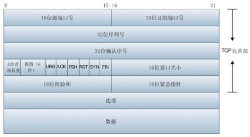
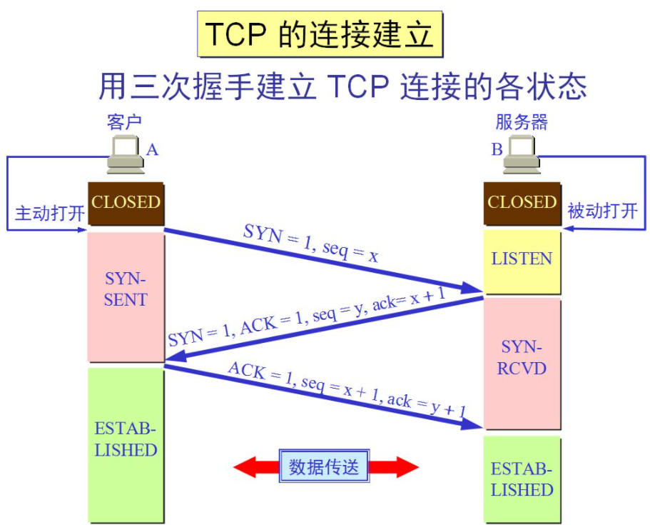
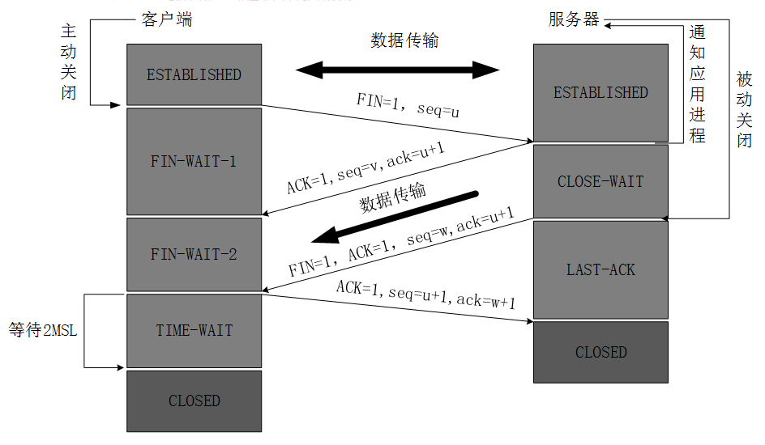

# TCP

## 概述

### 报文格式

1. **端口号**：源端口号、目的端口字段。各 16 位。

2. **序列号**：**SEQ** 序号，32 位。

   ​	TCP连接中传送的的数据流中的每一个字节都编上序号，序号字段的值则是本报文段所发送的数据的第一个字节的序号。

3. **确认序号**：**ACK** 序号，32 位。

   ​	期望收到对方写的下一个报文端的数据的第一个字节的序号。只有 ACK 标志位为 1 时，确认序号字段有效。ACK = SEQ + 1。

4. **标志位**：
   1. **URG**：紧急信号表明紧急指针（urgent pointer），它能告诉系统此报文段有紧急数据，应尽快传送。
   2. **ACK**：确认信号只有当 ACK = 1 时确认号字段才有效。当 ACK = 0 时，确认号无效。
   3. **PSH**：推送信号接收 TCP 推送 bit 置 1 的报文段，则尽快交付给接收应用进程，无需缓存。
   4. **RST**：复位信号当 RST=1 时,表明TCP连接中有严重错误，则释放连接，然后再重新建立连接。
   5. **SYN**：同步信号 SYN 表示一个连接请求或连接接收报文。
   6. **FIN**：终止信号用来释放一个连接。当 FIN=1，表明报文段的发送端的数据已发送完毕，要求释放运输连接。

5. **数据偏移**：4 位。

   ​	指出报文端的数据起始位置距离 TCP 报文段起始处的位置。

6. **保留字段**：6 位。

7. **窗口字段**：16 位。

   ​	控制对方发送的数据量，单位为字节。TCP 连接的一端根据设置的缓存空间大小确定自己的接收窗口大小，然后通知对方确定对方的发送窗口上限。

8. **检验和**：16 位。

   ​	检验报文段的首部和数据，在检验之前要加上 12 字节的伪首部。

9. **紧急指针字段**：16 位。

   ​	紧急指针指出在本报文段的紧急数据的最后一个字节的序号。

10. **选项字段**：无固定长度，TCP只规定了一种选项最大报文段长度MSS。

### 特点

1. 面向连接。
2. 每一条 TCP 只有两个断电，每一条 TCP 连接只能是点对点。
3. TCP 提供可靠交付的服务。通过 TCP 连接传送的数据，无差错、不丢失、不重复、并且按序到达。
4. 全双工通信。两端都设有发送缓存和接受缓存，临时存放双方通信的数据。
5. 面向字节流。

## 三次握手

​		TCP 建立连接位客户端服务器方式。主动建立的进程叫客户端（client）。被动等待建立的叫做服务器（server）。

- **第一次握手**：

  ​		client A 向 server 发送一个连接请求，包中标志位 SYN=1，发送需要 SEQ=x，上图中令 x=200，client A 进入 SYN_SEND 状态，等待 server 确认。

  

- **第二次握手**：

  ​		server 收到数据包后由标志位 SYN=1 知道 client 请求建立连接，server 将标志位 SYN 和 ACK 都置为 1，确认序号 ACK=X+1=201，随机阐述一个发送序号 y，令 y=500，并将该数据包发送给 client 以确认连接请求，server 进入 SYN_RCVD 状态。

- **第三次握手**：

  ​		client 收到确认后，检查确认序号 ACK 是否为 x+1=201，标志位 ACK 是否为1，如果正确，则将标志位 ACK 置 1，确认序号 ACK=y+1=501，并将该数据包发送给 server，server 检查确认序号 ACK 是否为 y+1=501，标志位是否为1，如果正确，则建立连接成功。client 和 server 都进入 ESTABLISHED 状态。

## 四次挥手

- **第一次挥手**：

  ​		当 client A 要断开 TCP 连接时，发送一个包，其中 FIN=1，序列号 SEQ=u（前面已经传过来的数据最后一个字节的序号加1），client 进入 FIN_WAIT 状态。

- **第二次挥手**：

  ​		当 client B 知道 A 要断开后，发送一个确认包，其中标志位 ACK=1，发送序号 SEQ=v，确认序号 ACK=u+1，server 端进入 CLOSE_WAIT（关闭等待） 状态。
  
  ​		TCP 服务器通知高层应用进程，客户端向服务器的方向释放，处于半关闭状态，即客户端没有数据要发送了，但是服务器端若发送数据，客户端依然要接受。这个状态要持续一段时间，就是整个 CLOSE_WAIT 状态持续的时间。
  
  ​		客户端收到服务器的确认请求后，此时，客户端进入 FIN_WAIT-2（终止等待2）状态，等待服务器发送连接释放报文（在这期间，服务器发送报文客户端依然接受）。

- **第三次挥手**：

  ​		服务器将最后的数据发送完毕后，就向客户端发送连接释放报文，FIN=1，确认序号 ack=u+1。由于在版关闭状态，服务器可能又发送了一些数据，假定此时的序列号为 SEQ=w，此时，服务器就进入了 LAST_ACK（最后确认）状态，等待客户端的确认。

  

- **第四次挥手**：

  ​		客户端收到服务器的连接释放报文后，必须发出确认，ACK=1，确认序号 ack=w+1，自己的序列号是 SEQ=u+1，此时客户端进入了 TIME_WAIT 状态。
  
  ​		此时 TCP 连接还没有释放，必须经过 2*MSL（最长报文寿命）的事件后，当客户端撤销相应的 TCB 后，才进入 CLOSED 状态。
  
  ​		服务器只要收到了客户端发出的确认，立即进入 CLOSED 状态。

# UDP

## 概述

### 特点

1. UDP 是无连接的。
2. UDP 使用最大努力交付，不保证可靠交付。主机不需要维持复杂的连接状态。
3. UDP 面向报文。
4. UDP 没有拥塞控制。网络出现拥塞不会使源主机的发送速率降低（对实时应用很有用，如 直播，实时视频会议等）。
5. UDP 支持一对一、一对多、多对一和多读多的交互通信。
6. UDP 首部开销小，只有 8 个字节，比 TCP 的 20 字节首部要短。

# 问题

### 1. 为什么客户端最后还要等 2MSL ？

​		MSL（Maximum Segment Lifetime），TCP 允许不同的实现可以设置不同的 MSL 值。

​		保证客户端发送最后一个 ACK 报文能到达服务器，因为报文可能丢。

​		客户端发玩最后一个确认报文后，在这个 2MSL 时间中，可以使本连接持续的时间内产生的所有报文从网络中小时。新的连接中不会出现旧连接的请求报文。

### 2. 保活计时器的作用？

​		TCP 设有一个保活计时器（keepalive timer），服务器没收到一次客户端的请求后会重新复位这个计时器，时间通常设置 2 小时。

​		若两小时没收到客户端的任何数据，服务器会发送一个探测报文段，每隔 75 秒发送一次。若一连发送 10 个探测报文仍然没反应，服务器就认为客户端出了故障，关闭连接。

### 3. TCP 协议如何保证可靠传输？

1. **数据包校验：**检测数据在传输过程中的任何变化，若校验出包有错，则丢弃报文段并且不给出响应，这时 TCP 发送数据端超时后会重发数据。
2. **对失序数据包重排序：**TCP 报文段作为 IP 数据报来传输，IP 数据报的到达可能会失序，TCP 报文段的到达也可能会失序。TCP 将对失序数据进行重新排序，然后才交给应用层。
3. **丢弃重复数据**：对于重复数据，能够丢弃重复数据。
4. **应答机制**：当 TCP 收到发自 TCP 连接另一端的数据，它将发送一个确认。这个确认不是立即发送，通常将推迟几分之一秒。
5. **超时重发**：当 TCP 发出一个段后，它启动一个定时器，等待目的端确认收到这个报文段。如果不能及时收到一个确认，将重发这个报文段
6. **流量控制**：TCP 连接的每一方都有固定大小的缓冲空间。TCP 的接收端只允许另一端发送接收端缓冲区所能接纳的数据，这可以防止较快主机致使较慢主机的缓冲区溢出，这就是流量控制。TCP 使用的流量控制协议是可变大小的滑动窗口协议。

### 4. 停止等待协议

​		停止等待协议是为了实现可靠传输的。

​		基本原理就是每发完一个分组就停止发送，等待对方确认。在收到确认后再发下一个分组。在停止等待协议中，若接收方收到重复分组，就丢弃该分组。但同时还要发送确认。

### 5. 滑动窗口

​		TCP 利用滑动窗口实现流量控制。

​		流量控制是为了控制发送方发送速率，保证接收方来得及接收。接收方发送的确认报文中的窗口字段可以用来控制发送方窗口大小，从而影响发送方的发送速率。将窗口字段设置为 0，则发送方不能发送数据。

### 6. TCP 拥塞控制、算法

​		在某段时间，若对网络中某一资源的需求超过了该资源所能提供的可用部分，网络的性能就要变坏。这种情况就叫拥塞。

​		拥塞控制就是为了防止过多的数据注入到网络中，这样就可以使网络中的路由器或链路不致于过载。拥塞控制所要做的都有一个前提，就是网络能够承受现有的网络负荷。

​		拥塞控制是一个全局性的过程，涉及到所有的主机，所有的路由器，以及与降低网络传输性能有关的所有因素。相反，流量控制往往是点对点通信量的控制，是个端到端的问题。流量控制所要做到的就是抑制发送端发送数据的速率，以便使接收端来得及接收。

​		为了进行拥塞控制，TCP 发送方要维持一个拥塞窗口（cwnd）的状态变量。拥塞控制窗口的大小取决于网络的拥塞程度，并且动态变化。发送方让自己的发送窗口取为拥塞窗口和接收方的接受窗口中较小的一个。

​		TCP 的拥塞控制采用了四种算法，即：慢开始、拥塞避免、快重传和快恢复。在网络层也可以使路由器采用适当的分组丢弃策略（如：主动队列管理 AQM），以减少网络拥塞的发生。

- **慢开始**

  ​		当主机开始发送数据时，如果立即把大量数据字节注入到网络，那么可能会引起网络阻塞，因为现在还不知道网络的符合情况。经验表明，较好的方法是先探测一下，即由小到大逐渐增大发送窗口，也就是由小到大逐渐增大拥塞窗口数值。cwnd 初始值为 1，每经过一个传播轮次，cwnd 加倍。

- **拥塞避免**

  ​		拥塞避免算法思路是让拥塞窗口 cwnd 缓慢增大，即每经过一个往返时间 RTT 就把发送方的 cwnd 加1。

- **快重传与快恢复**

  ​		在 TCP/IP 中，快速重传和快恢复（fast retransmit and recovery，FRR）是一种拥塞控制算法，它能快速恢复丢失的数据包。

  ​		没有 FRR，如果数据包丢失了，TCP 将会使用定时器来要求传输暂停。在暂停的这段时间内，没有新的或复制的数据包被发送。有了 FRR，如果接收机接收到一个不按顺序的数据段，它会立即给发送机发送一个重复确认。如果发送机接收到三个重复确认，它会假定确认件指出的数据段丢失了，并立即重传这些丢失的数据段。

  ​		有了 FRR，就不会因为重传时要求的暂停被耽误。当有单独的数据包丢失时，快速重传和快恢复（FRR）能最有效地工作。当有多个数据信息包在某一段很短的时间内丢失时，它则不能很有效地工作。

  

### 7. 如何解决拆包粘包

​		分包机制一般有两个通用的解决方法。

1. 特殊字符控制。

2. 在包头首添加数据包的长度。

   如果使用 netty 的话，就有专门的编码器和解码器解决拆包和粘包问题了。

