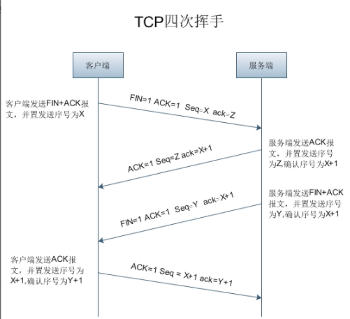

# TCP

## 报文格式

1. **端口号**：源端口号、目的端口字段。各 16 位。

2. **序列号**：**SEQ** 序号，32 位。

   ​	TCP连接中传送的的数据流中的每一个字节都编上序号，序号字段的值则是本报文段所发送的数据的第一个字节的序号。

3. **确认序号**：**ACK** 序号，32 位。

   ​	期望收到对方写的下一个报文端的数据的第一个字节的序号。只有 ACK 标志位为 1 时，确认序号字段有效。ACK = SEQ + 1。

4. **标志位**：
   1. **URG**：紧急信号表明紧急指针（urgent pointer），它能告诉系统此报文段有紧急数据，应尽快传送。
   2. **ACK**：确认信号只有当 ACK = 1 时确认号字段才有效。当 ACK = 0 时，确认号无效。
   3. **PSH**：推送信号接收 TCP 推送 bit 置 1 的报文段，则尽快交付给接收应用进程，无需缓存。
   4. **RST**：复位信号当 RST=1 时,表明TCP连接中有严重错误，则释放连接，然后再重新建立连接。
   5. **SYN**：同步信号 SYN 表示一个连接请求或连接接收报文。
   6. **FIN**：终止信号用来释放一个连接。当 FIN=1，表明报文段的发送端的数据已发送完毕，要求释放运输连接。

5. **数据偏移**：4 位。

   ​	指出报文端的数据起始位置距离 TCP 报文段起始处的位置。

6. **保留字段**：6 位。

7. **窗口字段**：16 位。

   ​	控制对方发送的数据量，单位为字节。TCP 连接的一端根据设置的缓存空间大小确定自己的接收窗口大小，然后通知对方确定对方的发送窗口上限。

8. **检验和**：16 位。

   ​	检验报文段的首部和数据，在检验之前要加上 12 字节的伪首部。

9. **紧急指针字段**：16 位。

   ​	紧急指针指出在本报文段的紧急数据的最后一个字节的序号。

10. **选项字段**：无固定长度，TCP只规定了一种选项最大报文段长度MSS。

## 三次握手

​		TCP 建立连接位客户端服务器方式。主动建立的进程叫客户端（client）。被动等待建立的叫做服务器（server）。

- **第一次握手**：

  ​		client A 向 server 发送一个连接请求，包中标志位 SYN=1，发送需要 SEQ=x，上图中令 x=200，client A 进入 SYN_SEND 状态，等待 server 确认。

  

- **第二次握手**：

  ​		server 收到数据包后由标志位 SYN=1 知道 client 请求建立连接，server 将标志位 SYN 和 ACK 都置为 1，确认序号 ACK=X+1=201，随机阐述一个发送序号 y，令 y=500，并将该数据包发送给 client 以确认连接请求，server 进入 SYN_RCVD 状态。

- **第三次握手**：

  ​		client 收到确认后，检查确认序号 ACK 是否为 x+1=201，标志位 ACK 是否为1，如果正确，则将标志位 ACK 置 1，确认序号 ACK=y+1=501，并将该数据包发送给 server，server 检查确认序号 ACK 是否为 y+1=501，标志位是否为1，如果正确，则建立连接成功。client 和 server 都进入 ESTABLISHED 状态。

## 四次挥手

- **第一次挥手**：

  ​		当 client A 要断开 TCP 连接时，发送一个包，其中 FIN=1，ACK=1，发送需要 SEQ=x，确认序号 ACK=z，client 进入 FIN_WAIT 状态。

- **第二次挥手**：

  ​		当 client B 知道 A 要断开后，发送一个确认包，其中标志位 ACK=1，发送序号 SEQ=z，确认序号 ACK=x+1，server 端进入 CLOSE_WAIT 状态。

- **第三次挥手**：

  ​		客户 B 也断开 TCP 连接，此时发送一个包，标志位 FIN=1，发送序号 SEQ=z+1，server 进入 LAST_ACK 状态。

  

- **第四次挥手**：

  ​		客户 A 收到 B 的断开请求后，client 进入 TIME_WAIT 状态，接着发送一个确认包，标志位 ACK=1，发送序号 SEQ=x+1，确认序号 ACK=z+2，server 进入 close 状态。