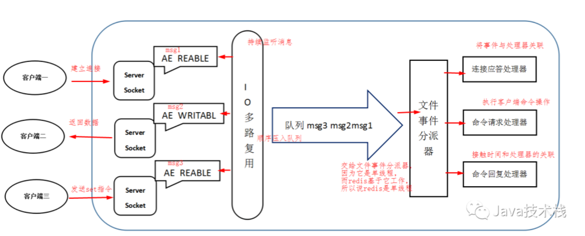
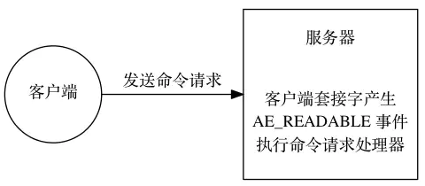
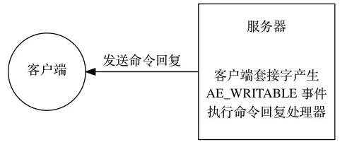
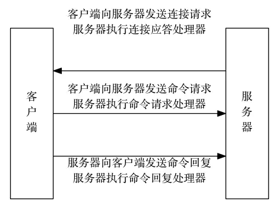

# redis 线程模型

执行 redis 命令的核心模块是单线程的，而不是整个 redis 就一个线程，redis 其他模块还有各自模块的线程。

## 文件事件处理器

redis 基于 Reactor模式 开发了网络事件处理器，被称为文件事件处理器。组成结构为 4 部分：

- 多个套接字
- IO 多路复用程序
- 文件事件分派器
- 事件处理器

> redis 4.0 开始就有多线程的概念了，比如 redis 通过多线程方式在后台删除对象，以及通过 redis 模块实现的阻塞命令等。

## 消息处理流程

- 文件事件处理器使用 I/O 多路复用程序来同时监听多个套接字，并根据套接字目前执行的任务来为套接字关联不同的事件处理器。
- 当被监听的套接字准备好执行连接应答（accept）、读取（read）、写入（write）、关闭（close）等操作时，与操作相对应的文件事件就会产生，这时文件事件处理器就会调用套接字之前关联好的事件处理器来处理这些事件。

​		尽管多个文件事件可能会并发的出现，但 I/O 多路复用程序总是会将所有产生事件的套接字都推到一个队列里面，然后通过这个队列，以有序（sequentially）、同步（synchronously）、每次一个套接字的方式向文件事件分派器传送套接字。当上一个套接字产生的事件被处理完毕之后，I/O 多路复用程序才会继续向文件事件分派器传送下一个套接字。

## I/O 多路复用程序实现

​		Redis的I/O多路复用程序的所有功能是通过包装 select、epoll、evport 和 kqueue这些 I/O 多路复用函数库来实现的，每个 I/O 多路复用函数库在 redis 源码中都对应一个单独的文件，比如 ae_select.c、ae_epoll.c、ae_kqueue.c 等。

## 文件事件的类型

I/O 多路复用程序可以监听多个套接字的 **ae.h/AE_READABLE** 事件和 **ae.h/AE_WRITABLE** 事件，这两类事件和套接字操作之间的对应关系如下：

- 当套接字变得可读时（客户端对套接字执行write操作，或者执行close操作），或者有新的可应答（acceptable）套接字出现时（客户端对服务器的监听套接字执行connect操作），套接字产生AE_READABLE 事件。
- 当套接字变得可写时（客户端对套接字执行read操作），套接字产生AE_WRITABLE事件。I/O多路复用程序允许服务器同时监听套接字的AE_READABLE事件和AE_WRITABLE事件，如果一个套接字同时产生了这两种事件，那么文件事件分派器会优先处理AE_READABLE事件，等到AE_READABLE事件处理完之后，才处理AE_WRITABLE 事件。这也就是说，如果一个套接字又可读又可写的话，那么服务器将先读套接字，后写套接字。

## 文件事件的处理器

redis 为文件事件编写了多个处理器，这些事件处理器分别用于实现不同的网络通讯需求。

- 为了对**连接服务器的各个客户端进行应答**，服务器要为监听套接字关联连接应答处理器。
- 为了**接受客户端传来的命令请求**，服务器要为客户端套接字关联命令请求处理器。
- 为了**向客户端返回命令的执行结果**，服务器要为客户端套接字关联命令回复处理器。

#### 连接应答处理器

​		当 redis 服务器进行初始化的时候，程序会将这个连接应答处理器和服务器监听套接字的 AE_READABLE 事件关联起来，当有客户端用 sys/socket.h/connect 函数连接服务器监听套接字的时候， 套接字就会产生 AE_READABLE  事件， 引发连接应答处理器执行， 并执行相应的套接字应答操作。

#### 命令请求处理器

​		当一个客户端通过连接应答处理器成功连接到服务器之后， 服务器会将客户端套接字的 AE_READABLE 事件和命令请求处理器关联起来，当客户端向服务器发送命令请求的时候，套接字就会产生 AE_READABLE 事件，引发命令请求处理器执行，并执行相应的套接字读入操作。

#### 命令回复处理器

​		当服务器有命令回复需要传送给客户端的时候，服务器会将客户端套接字的 AE_WRITABLE 事件和命令回复处理器关联起来，当客户端准备好接收服务器传回的命令回复时，就会产生 AE_WRITABLE 事件，引发命令回复处理器执行，并执行相应的套接字写入操作。

#### 一次客户端与服务器连接事件

​		假设 redis 服务器正在运作，那么这个服务器的**监听套接字的 AE_READABLE 事件应该正处于监听状态**之下，而该事件所对应的处理器为**连接应答处理器**。

​		如果这时有一个 redis 客户端向 redis 服务器发起连接，那么监听套接字将产生 AE_READABLE 事件， 触发连接应答处理器执行：处理器会对客户端的连接请求进行应答， 然后**创建客户端套接字**，以及**客户端状态**，并将客户端套接字的 AE_READABLE 事件与命令请求处理器进行关联，使得客户端可以向主服务器发送命令请求。

​		之后，**客户端向Redis服务器发送一个命令请求**，那么客户端套接字将产生 AE_READABLE事件，引发命令请求处理器执行，**处理器读取客户端的命令内容**， 然后传给相关程序去执行。

​		执行命令将产生相应的命令回复，为了将这些命令回复传送回客户端，服务器会将客户端套接字的 **AE_WRITABLE 事件与命令回复处理器进行关联**：当客户端尝试读取命令回复的时候，客户端套接字将产生AE_WRITABLE 事件， 触发命令回复处理器执行， 当命令回复处理器将命令回复全部写入到套接字之后， 服务器就会解除客户端套接字的 AE_WRITABLE 事件与命令回复处理器之间的关联。

## 线程安全问题

​		redis 实际上是采用了线程封闭的观念，把任务封闭在一个线程，自然避免了线程安全问题。不过对于需要依赖多个redis操作的复合操作来说，依然需要锁，而且有可能是分布式锁。