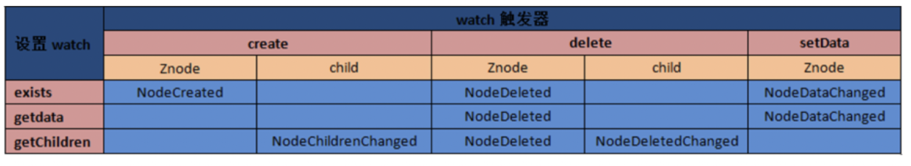
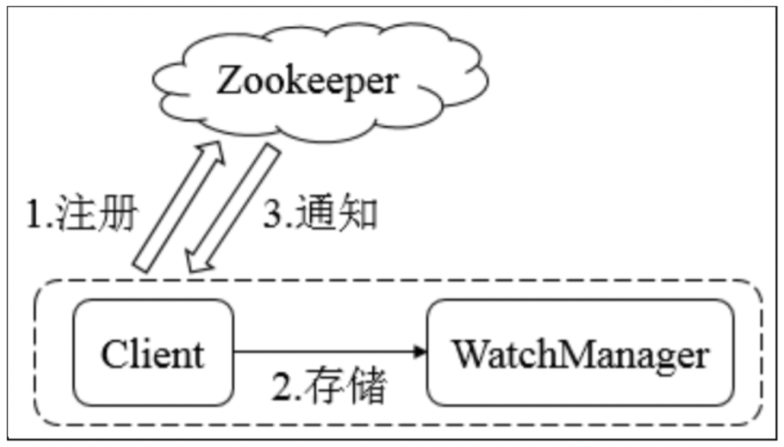

## 概述

​		一种分布式协调技术。是 Google 的 Chubby 一个开源的实现。提供了简单原始的功能，分布式应用可以基于它实现更高级的服务。比如 **分布式同步**、**配置管理**、**集群管理**、**命名管理**、**队列管理**。

## 服务中的操作

- **create**：创建 Znode（父 Znode 必须存在）
- **delete**：删除 Znode（Znode 没有子节点）
- **exists**：测试 Znode 是否存在，并获取他的元数据
- **getACL/setACL**：为 Znode 获取/设置 ACL
- **getChildren**：获取 Znode 所有子节点的列表
- **getData/setData**：获取/设置 Znode 的相关数据
- **sync**：使客户端的 Znode 视图与 zookeeper 同步

​		更新ZooKeeper操作是有限制的。delete或setData必须明确要更新的Znode的版本号，我们可以调用exists找到。如果版本号不匹配，更新将会失败。

　　更新ZooKeeper操作是非阻塞式的。因此客户端如果失去了一个更新(由于另一个进程在同时更新这个Znode)，他可以在不阻塞其他进程执行的情况下，选择重新尝试或进行其他操作。

　　尽管ZooKeeper可以被看做是一个文件系统，但是处于便利，摒弃了一些文件系统地操作原语。因为文件非常的小并且使整体读写的，所以不需要打开、关闭或是寻地的操作。

## 触发器

#### watch概述

​		zk可以为所有的读操作设置watch，这些读操作包括：exists()、getChildren()及getData()。

​		watch事件是**一次性的触发器**，当watch的对象状态发生改变时，将会触发此对象上watch所对应的事件。watch事件将被**异步**地发送给客户端，并且ZooKeeper为watch机制提供了有序的**一致性保证**。理论上，客户端接收watch事件的时间要快于其看到watch对象状态变化的时间。

#### watch类型

zk所管理的watch可以分为两类：

1. 数据watch(data watches)：**getData** 和 **exists** 负责设置数据 watch
2. 孩子watch(child watches)：**getChildren** 负责设置孩子 watch

可以通过操作返回的数据来设置不同的watch：

1. getData 和 exists：返回关于节点的数据信息
2. getChildren：返回孩子列表

因此

- 一个成功的 setData 操作将触发 Znode 的数据 watch
- 一个成功的 create 操作将触发 Znode 的数据 watch 以及孩子 watch
- 一个成功的 delete 操作将触发 Znode 的数据 watch 以及孩子 watch

#### watch 注册与触发

设置操作及响应的触发器如下图所示：

1. exists 操作上的watch，在被监视的Znode**创建**、**删除**或**数据更新**时被触发。
2. getData操作上的watch，在被监视的Znode**删除**或**数据更新**时被触发。在被创建时不能被触发，因为只有Znode一定存在，getData操作才会成功。
3. getChildren操作上的watch，在被监视的Znode的子节点**创建**或**删除**，或是这个Znode自身被**删除**时被触发。可以通过查看watch事件类型来区分是Znode，还是他的子节点被删除：NodeDelete表示Znode被删除，NodeDeletedChanged表示子节点被删除。

​		Watch由客户端所连接的ZooKeeper服务器在本地维护，因此watch可以非常容易地设置、管理和分派。当客户端连接到一个新的服务器时，任何的会话事件都将可能触发watch。另外，当从服务器断开连接的时候，watch将不会被接收。但是，当一个客户端重新建立连接的时候，任何先前注册过的watch都会被重新注册。

zk的watch实际上要处理两类事件：

1. 连接状态事件(type=None，path=null)

   这类事件不需要注册，也不需要我们连续触发，我们只要处理就行了。

2. 节点事件

   节点的建立，删除，数据的修改。它是one time trigger，我们需要不停的注册触发，还可能发生事件丢失的情况。

   上面2类事件都在Watch中处理，也就是重载的**process(Event event)**

   

**节点事件的触发，通过函数 exists，getData或getChildren来处理这类函数，有双重作用：**

1. 注册触发事件
2. 函数本身的功能

函数本身的功能又可以用异步的回调函数来实现，重载 processResult() 过程中处理函数本身的功能。

#### 监听工作原理

​		zk的watcher机制主要包括客户端线程、客户端 watcherManager、zookeeper服务器三部分。客户端在向zk服务器注册的同时，会将Watcher对象存储在客户端的 watcherManager当中。当zk触发watcher事件后，会向客户端发送通知，客户端现成从watcherManager中去取相应的Watcher对象来执行回调逻辑。

