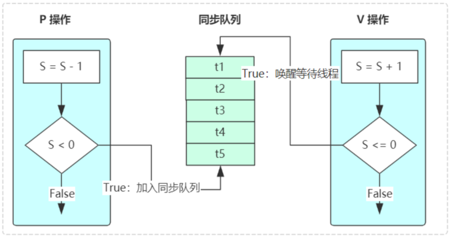
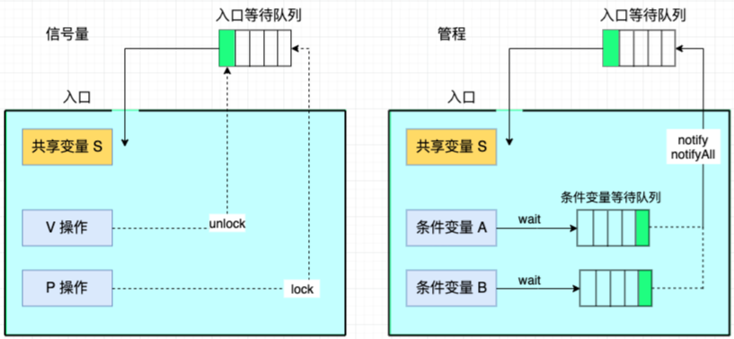
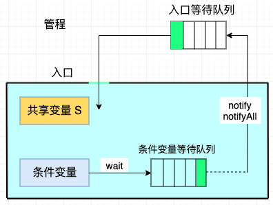
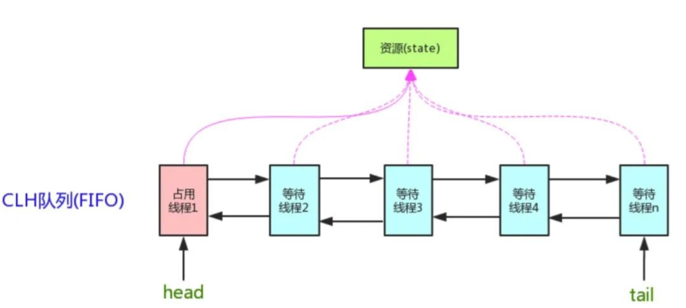
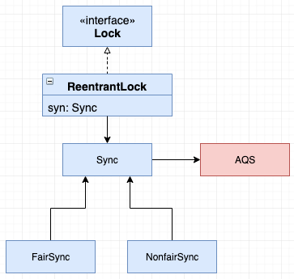
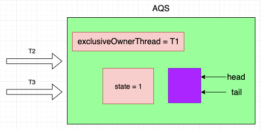
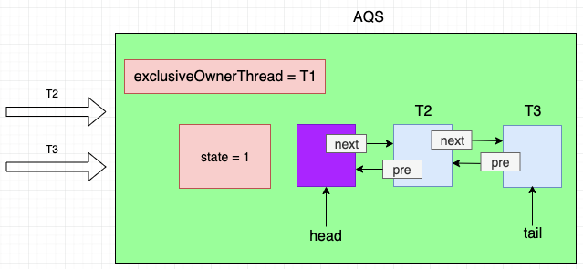
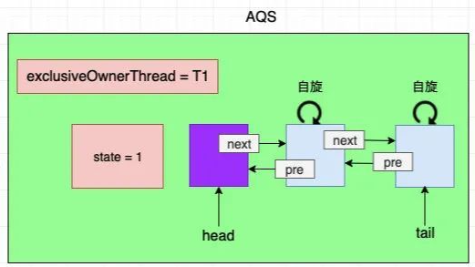

# AQS（AbstractQueuedSynchronizer）

AQS 是一个用来构建 **锁** 和 **同步器** 的框架。

Lock 包中的各种锁（ReentrantLock、ReadWriteLock），JUC 包中的各种同步器（CountDownLatch、Semaphore、CyclicBarrier）都是基于 AQS 来构建。


## 锁原理 - 信号量 vs 管程

并发编程领域两大核心问题：互斥与同步。

- **互斥**：即同一时刻只允许一个线程访问共享资源。
- **同步**：即线程之间如何通信、协作。

> 一般这两大问题可以通过 **信号量** 和 **管程** 来解决。


### 信号量

​		信号量（Semaphore）是操作系统提供的一种进程间常见的通信方式，主要用来协调并发程序对共享资源的访问，操作系统可以保证对信号量操作的原子性。

- 信号量由一个共享整形变量 S 和两个原子操作 PV 组成，S 只能通过 P 和 V 操作来改变。
- P 操作：即请求资源，意味着 S 要减 1，如果 S < 0，则表示没有资源了，此时线程要进入等待队列（同步队列）等待。
- V 操作：即释放资源，意味着 S 要加 1，如果 S <= 0，说明等待队列里由线程，此时就需要唤醒线程。



信号量机制的引入解决了进程同步和互斥问题，但信号量的大量同步操作分散在各个进程中不便于管理，还有可能导致系统死锁。如：生产者消费者问题中将 P、V 颠倒可能死锁。

### 管程

​		把所有进程对某一种 **临界资源** 的同步操作都集中起来，构成一个所谓的秘书进程。凡要访问该临界资源的进程，都需先报告秘书，由秘书来实现诸进程对同一临界资源的 **互斥** 使用，这种机制就是管程。

​		管程是一种在信号量机制上进行改进的并发编程模型，解决了信号量在临界区的 PV 操作上配对的麻烦，把配对的 PV 操作几种在一起而形成的并发编程方法理论。

管程由**四部分组成**：

1. 管程内部的共享变量。
2. 管程内部的条件变量。
3. 管程内部并行执行的进程。
4. 对于局部与管程内部的共享数据设置初始值的语句。

​		由此可见，**管程就是一个对象监视器**。任何线程想要访问该资源（共享变量），就要排队进入监控范围。进入之后，接受检查，不符合条件，则要继续等待，直到被通知，然后继续进入监视器。

​		信号量和管程两者是等价的，信号量可以实现管程，管程也可以实现信号量，只是两者表现形式不同而已，管程对开发者更加友好。



管程为了解决信号量在临界区的 PV 操作上的配对的麻烦，把配对的 PV 操作集中在一起，并且加入了条件变量的概念，使多条件下线程间的同步实现变得更加简单。

> 在 Java 里，锁大多使依赖于管程来实现的。



上图表示，synchronized 锁也是基于管程实现的，只不过它有且只有一个条件变量（就是锁对象本身）。着也是为什么 jdk 要实现 lock 锁，lock 支持多个条件变量。


## AQS 实现原理

​		AQS 全称 AbstractQueuedSynchronizer，是一个用来构建锁和同步器的框架，它维护了一个**共享资源 state** 和一个 **FIFO 的等待队列**，底层利用了 **CAS 机制来保证操作的原子性**。


### AQS 实现锁的主要原理



​		以独占锁为例（即当前资源只能被一个线程占有），其实现原理如下：state 初始化 0，在多线程条件下，线程要执行临界区的代码，必须首先获得 state，某个线程获取成功之后，state 加 1，其他线程再获取的话由于共享资源已被占用，所以回到 FIFO 等待队列去等待，等占有 state 的线程执行完临界区的代码释放资源（state 减 1）后，会唤醒 FIFO 中的下一个等待线程（head 中的下一个节点）去获取 state。


> state 由于是多线程共享变量，所以必须定义成 volatile，以保证 state 的可见性，同时虽然 volatile 能保证可见性，但不能保证原子性，所以 **AQS 提供了对 state 的原子操作**方法，保证了线程安全。


​		AQS 中实现的 FIFO 队列（CLH 队列）其实是双向链表实现的，由 head、tail 节点表示，head 节点代表当前占用的线程，其他节点由于暂时获取不到锁所以依次排队等待锁释放。


### AQS 代码定义

```java
public abstract class AbstractQueuedSynchronizer extends AbstractOwnableSynchronizer 
    implements java.io.Serializable {
    
    // 以下为双向链表的首尾结点，代表入口等待队列
    private transient volatile Node head;
    private transient volatile Node tail;
    
    // 共享变量 state
    private volatile int state;
    
    // cas 获取/释放 state，保证线程安全地获取锁
    protected final boolean compareAndSetState(int expect, int update) {
        // See below for intrinsics setup to support this
        return unsafe.compareAndSwapInt(this, stateOffset, expect, update);
    }
    // ...
 }
```


## AQS源码刨析


### ReentrantLock

ReentrantLock 是我们比较常用的一种锁，也是基于 AQS 实现的。

ReentrantLock 是**独占锁**，也有 **公平** 和 **非公平 两种锁模式**。

> 与 **独占锁** 对应的是 **共享锁**。

- **独占锁**：即其他线程只有在占有锁的线程释放后才能竞争锁，有且只有一个线程能竞争成功。
- **共享锁**：即共享资源可以被多个线程同时占有，知道共享资源被占用完毕，常见的有读写锁 ReadWriteLock、CountdownLatch。


#### ReentrantLock 使用方法

```java
// 初始化可重入锁
private ReentrantLock lock = new ReentrantLock();

public void run() {
    // 加锁
    lock.lock();
    try {
        // 2. 执行临界区代码
    } catch (InterruptedException e) {
        e.printStackTrace();
    } finally {
        // 3. 解锁
        lock.unlock();
    }
}
```


初始化可重入锁，默认使用的是非公平锁机制。

```java
public ReentrantLock () {
    sync = new NonfairSync();
}

// 也可以用一下构造方法指定使用公平锁。
public ReentrantLock (boolean fair) {
    sync = fair ? new FairSync() : new NonfairSync();
}
```

> FairSync 和 NonfairSync 是 Reentrantlock 实现的内部类，分别指公平和非公平模式，ReentrantLock 的加锁（lock），解锁（unlock）在内部具体都是调用的 FairSync、NonfairSync 的加锁和解锁方法。


#### 类图



#### NonfairSync 实现方式

```java
public void lock () {
    sync.lock();
}

static final class NonfairSync extends Sync {
    final void lock () {
        if (compareAndSetState(0, 1))
            setExclusiveOwnerThread(Thread.currentThread());
        else
            acquire(1);
    }
}
```

lock 方法主要有两步

1. 使用 CAS 来获取 state 资源，如果成功设置 1，代表 state 资源获取锁成功，此时记录下当前占用 state 的线程 **setExclusiveOwnerThread(Thread.currentThread())**。

2. 如果 CAS 设置 state 为 1 失败（代表获取锁失败），则执行 acquire(1) 方法，这个方法是 AQS 提供的方法。

   ```java
   public final void acquire(int arg) {
       if (!tryAcquire(arg) &&
               acquireQueued(addWaiter(Node.EXCLUSIVE), arg))
               selfInterrupt();
   }
   ```

##### tryAcquire 刨析

调用 tryAcquire 尝试获取 state，如果成功，则跳过后面的步骤。如果失败，则执行 acquiredQueued 将线程加入 CLH 等待队列中。

tryAcquire 方法：

```java
final boolean nonfairTryAcquire(int acquires) {
    final Thread current = Thread.currentThread();
    int c = getState();

    if (c == 0) {
        // 如果 c 等于 0，表示此时资源是空闲的（即锁是释放的），再用 CAS 获取锁
        if (compareAndSetState(0, acquires)) {
            setExclusiveOwnerThread(current);
            return true;
        }
    }
    else if (current == getExclusiveOwnerThread()) {
        // 此条件表示之前已有线程获得锁，且此线程再一次获得了锁，获取资源次数再加 1，这也映证了 ReentrantLock 为可重入锁
        int nextc = c + acquires;
        if (nextc < 0) // overflow
            throw new Error("Maximum lock count exceeded");
        setState(nextc);
        return true;
    }
    return false;
}
```

1. state 为 0 时，代表锁已经被释放，可以去获取，于是使用 CAS 去重新获取锁资源，如果获取成功，则代表竞争锁成功，使用setExclusiveOwnerThread(current) 记录下此时占有锁的线程。
2. 如果 state 不为 0，代表之前已有线程占有了锁，如果此时的线程依然是之前站有锁的线程，代表此线程再一次占有了锁（可重入锁），此时更新 state，记录下锁被占有的次数（锁的重入次数），这里的 setState 方法不需要使用 CAS 更新，因为此时的锁就是当前线程占有的，其他线程没有机会进入这段代码执行，所以此时更新  state 是线程安全的。

##### acquireQueued 刨析

如果 tryAcquire(arg) 执行失败，代表获取锁失败，则执行 acquireQueued 方法，将线程加入 FIFO 等待队列。

```java
public final void acquire(int arg) {
    if (!tryAcquire(arg) &&
        acquireQueued( addWaiter(Node.EXCLUSIVE), arg))
        selfInterrupt();
}
```

调用 addWaiter(Node.EXCLUSIVE) 将包含有当前线程的 Node 节点入队，Node.EXCLUSIVE 代表此节点为**独占模式**。

```java
private Node addWaiter(Node mode) {
    Node node = new Node(Thread.currentThread(), mode);
    Node pred = tail;
    // 如果尾结点不为空，则用 CAS 将获取锁失败的线程入队
    if (pred != null) {
        node.prev = pred;
        if (compareAndSetTail(pred, node)) {
            pred.next = node;
            return node;
        }
    }
    // 如果结点为空，执行 enq 方法
    enq(node);
    return node;
}
```

首先获取 FIFO 队列的尾节点，如果尾节点存在，则采用 CAS 的方式将等待线程入队，如果尾节点为空则执行 enq 方法。

```java
private Node enq(final Node node) {
    for (;;) {
        Node t = tail;
        if (t == null) {
            // 尾结点为空，说明 FIFO 队列未初始化，所以先初始化其头结点
            if (compareAndSetHead(new Node()))
                tail = head;
        } else {
            // 尾结点不为空，则将等待线程入队
            node.prev = t;
            if (compareAndSetTail(t, node)) {
                t.next = node;
                return t;
            }
        }
    }
}
```

1. 假设 T1 获取锁成功，由于此时 FIFO 未初始化，所以先创建 head 节点

   

2. 此时 T2 或 T3 再去竞争 state 失败，入队。

   

   T2、T3 入队后，采用让它们自旋来竞争锁，如下图。

   

   ​		合适的方式是它们自旋一两次竞争不到锁后识趣的阻塞以等待前置节点释放锁后再来唤醒它。另外如果锁在自旋过程中被中断了，或者自旋超时了，应该处于【取消】状态。

   ​		基于每个 Node 可能所处的状态，AQS 为其定义了一个变量 waitStatus，根据这个变量值对相应节点进行相关的操作。

   ```java
   static final class Node {
       // 标识等待节点处于共享模式
       static final Node SHARED = new Node();
       // 标识等待节点处于独占模式
       static final Node EXCLUSIVE = null;
   
       // 由于超时或中断，节点已被取消
       static final int CANCELLED = 1;
       // 节点阻塞（park）必须在其前驱结点为 SIGNAL 的状态下才能进行，如果结点为 SIGNAL,则其释放锁或取消后，可以通过 unpark 唤醒下一个节点，
       static final int SIGNAL = -1;
       // 表示线程在等待条件变量（先获取锁，加入到条件等待队列，然后释放锁，等待条件变量满足条件；只有重新获取锁之后才能返回）
       static final int CONDITION = -2;
       // 表示后续结点会传播唤醒的操作，共享模式下起作用
       static final int PROPAGATE = -3;
   
       // 等待状态：对于condition节点，初始化为CONDITION；其它情况，默认为0，通过CAS操作原子更新
       volatile int waitStatus;
   ```

##### 锁释放

不管是公平锁还是非公平锁，最终都是调的 AQS 的如下模板方法来释放锁

```java
// java.util.concurrent.locks.AbstractQueuedSynchronizer

public final boolean release(int arg) {
    // 锁释放是否成功
    if (tryRelease(arg)) {
        Node h = head;
        if (h != null && h.waitStatus != 0)
            unparkSuccessor(h);
        return true;
    }
    return false;
}
```

tryRelease 方法定义在了 AQS 的子类 Sync 方法里

```java
// java.util.concurrent.locks.ReentrantLock.Sync

protected final boolean tryRelease(int releases) {
    int c = getState() - releases;
    // 只有持有锁的线程才能释放锁，所以如果当前锁不是持有锁的线程，则抛异常
    if (Thread.currentThread() != getExclusiveOwnerThread())
        throw new IllegalMonitorStateException();
    boolean free = false;
    // 说明线程持有的锁全部释放了，需要释放 exclusiveOwnerThread 的持有线程
    if (c == 0) {
        free = true;
        setExclusiveOwnerThread(null);
    }
    setState(c);
    return free;
}
```

锁释放成功后，唤醒之后 head 之后节点，让它来竞争锁。

```java
// java.util.concurrent.locks.AbstractQueuedSynchronizer

public final boolean release(int arg) {
    // 锁释放是否成功
    if (tryRelease(arg)) {
        Node h = head;
        if (h != null && h.waitStatus != 0)
            // 锁释放成功后，唤醒 head 之后的节点，让它来竞争锁
            unparkSuccessor(h);
        return true;
    }
    return false;
}
```

###### 释放锁的条件为什么是 h != null && h.waitStatus != 0 。

1. 如果 h == null, 这有两种可能，一种是一个线程在竞争锁，现在它释放了，当然没有所谓的唤醒后继节点，一种是其他线程正在运行竞争锁，只是还未初始化头节点，既然其他线程正在运行，也就无需执行唤醒操作
2. 如果 h != null 且 h.waitStatus == 0，说明 head 的后继节点正在自旋竞争锁，也就是说线程是运行状态的，无需唤醒。
3. 如果 h != null 且 h.waitStatus < 0, 此时 waitStatus 值可能为 SIGNAL，或 PROPAGATE，这两种情况说明后继结点阻塞需要被唤醒


## 如何利用 AQS 自定义互斥锁

AQS 通过提供 state 及 FIFO 队列的管理，为我们提供了一套通用的实现锁的底层方法，基本上定义一个锁，都是转为在其内部定义 AQS 的子类，调用 AQS 的底层方法来实现的，由于 AQS 在底层已经为了定义好了这些获取 state 及 FIFO 队列的管理工作，我们要实现一个锁就比较简单了，可以基于 AQS 来实现一个非可重入的互斥锁。

```java
public class Mutex  {

    private Sync sync = new Sync();
    
    public void lock () {
        sync.acquire(1);
    }
    
    public void unlock () {
        sync.release(1);
    }

    private static class Sync extends AbstractQueuedSynchronizer {
        @Override
        protected boolean tryAcquire (int arg) {
            return compareAndSetState(0, 1);
        }

        @Override
        protected boolean tryRelease (int arg) {
            setState(0);
            return true;
        }

        @Override
        protected boolean isHeldExclusively () {
            return getState() == 1;
        }
    }
}
```


> https://zhuanlan.zhihu.com/p/268317084


