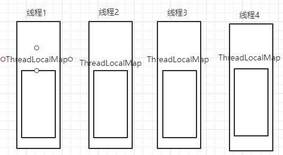

# ThreadLocal

`ThreadLocal `类是一个线程数据绑定类。

所有线程共享，但读取其中数据时又只能是获取线程自己的数据, 写入也只能给线程自己的数据。


## 源码分析

```java
public T get () {
    // 获取当前线程
    Thread t = Thread.currentThread();
    // 获取 ThreadLocalMap
    ThreadLocal.ThreadLocalMap map = getMap(t);
    // map不为null
	if (map != null) {
		// 根据this获取我们的entry
		ThreadLocal.ThreadLocalMap.Entry e = map.getEntry(this);
		if (e != null) {
			@SuppressWarnings("unchecked")
			T result = (T)e.value;
			return result;
		}
	}
	// 如果map获取为空, 则初始化
	return setInitialValue();
}
```

`ThreadLocal` 底层使用的不是类似 `Map<Thread, Data>` 这种结构而是




> 引用：https://juejin.cn/post/6844904201227599879

#### 总结

​		每个线程都有一个属于自己的 `ThreadLocalMap` 类, 他用于关联多个以 `ThreadLocal` 对象为 `key`, 以`你的数据` 为` value`的` Entry `对象, 且该对象的`key`是一个`弱引用对象`。

#### Entry

它继承了弱引用类 **WeakReference**

```java
static class Entry extends WeakReference<ThreadLocal<?>> {
    Object value;

    Entry(ThreadLocal<?> k, Object v) {
        // ThreadLocal被设置为弱引用
        super(k);
        // 保存value
        value = v;
    }
}
```


