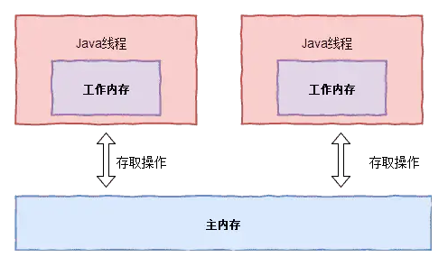

# volatile

## 保证线程可见性

在工作内存中，每次使用变量之前都必须从主内存刷新最新的值。

在工作内存中，每次修改变量的值之后都要立刻同步回主内存中。


## volatile 禁止指令重排序

- 保证变量对所有线程的可见性。

- 禁止指令重排序

  指令重排序时不能把后面的指令重排序到内存屏障之前的位置。

loadfence 进而 storefence 原语。

#### 原子性

#### 可见性

#### 有序性


#### MESI 高速缓存一致性协议

volatile 的线程可见性在 CPU 的级别是用缓存一致性来保证的。

#### DCL单例

```java
public class DCLSingleton {
    // 什么时候用什么时候初始化 属于懒汉式
    // volatile禁止指令重排序 因为new DCLSingleton()分为三步 1、给指令申请内存2、给成员变量初始化3、把这块内存的内容赋值给INSTANCE
    private static volatile DCLSingleton INSTANCE;
    // 构造方法设置private 只能在内部new
    private DCLSingleton(){}

    public static DCLSingleton getInstance(){
        if(INSTANCE == null){
            synchronized (DCLSingleton.class){
                if(INSTANCE == null){
                    INSTANCE = new DCLSingleton();
                }
            }
        }
        return INSTANCE;
    }
}
```

#### 底层实现

##### CAS

#### Atomic类（原子的）

AtomicInteger 的 incrementAndGet 方法调用了 unsafe 类的方法 compareAndSet

cas(V,Expected,NewValue) V 是要改的那个值，Expected 是期望的值，NewValue 是要设置的新值

ABA问题


## volatile 的使用

​		在 Java 内存模型中，为了提示程序的运行速度，Java 将内存分为了工作内存（线程独占，不与其他线程共享）与主内存。当多个线程同时访问同一个对象或者变量的时候，由于每个线程都需要将该对象或变量拷贝到自己的工作内存中。又因为线程的工作内存是私有且不与其他线程共享的。那么当一线程修改变量的值后，会导致对其他线程不可见。



volatile关键字修饰变量，就是告知线程对该变量的访问必须从主内存中获取。而对它的改变必须同步刷新到主内存中。这样就能保证线程对变量访问的可见性。