# 线程池


## Executors 提供的线程池

1. **newFixedThreadPool**：创建固定大小的线程池。线程池的大小一旦达到最大值就会保持不变，如果某个线程因为执行异常而结束，那么线程池会补充一个新线程。

   ```java
   /*
   	函数功能：创建一个固定长度的的线程池，用于保存任务的阻塞队列为无限制长度的LinkedBlockingQueue。
                 线程池中的线程将会一直存在除非线程池shutdown，即线程池中的线程没有受到存活时间的限制。
   */
   public static ExecutorService newFixedThreadPool(int nThreads) {
       return new ThreadPoolExecutor(nThreads, nThreads,
                                     0L, TimeUnit.MILLISECONDS,
                                     new LinkedBlockingQueue<Runnable>());
   }
   
   /*
   	函数功能：创建指定线程数的线程池，并且指定了线程工厂来生产新的线程。任务队列无界。
   */
   public static ExecutorService newFixedThreadPool(int nThreads, ThreadFactory threadFactory) {
       return new ThreadPoolExecutor(nThreads, nThreads,
                                     0L, TimeUnit.MILLISECONDS,
                                     new LinkedBlockingQueue<Runnable>(),
                                     threadFactory);
   }
   ```

2. **newCachedThreadPool**：创建一个可缓存的线程池。如果线程池的大小超过了处理任务所需要的线程，那么就会回收部分空闲（60秒不执行任务）的线程，当任务数增加时，此线程池又可以智能的添加新线程来处理任务。此线程池不会对线程池大小做限制，线程池大小完全依赖于操作系统（或者说 jvm）能够创建的最大线程大小。

   ```java
   /*
   	函数功能：创建一个线程池，这个线程池的corePoolSize的大小为零，maxPoolSize为Integer.MAX_VALUE.
   		即对于线程池，只要需要就可以创建新的线程。不过如果有空闲线程存在则就会重用此线程。
   		此线程池的线程都有一定的存活时间。即如果线程已经有60s没有被使用则就会被移除线程池。
   */
   public static ExecutorService newCachedThreadPool() {
       return new ThreadPoolExecutor(0, Integer.MAX_VALUE,
                                     60L, TimeUnit.SECONDS,
                                     new SynchronousQueue<Runnable>());
   }
   
   // 与上面的功能一样，只是指定了线程工厂。
   public static ExecutorService newCachedThreadPool(ThreadFactory threadFactory) {
       return new ThreadPoolExecutor(0, Integer.MAX_VALUE,
                                     60L, TimeUnit.SECONDS,
                                     new SynchronousQueue<Runnable>(),
                                     threadFactory);
   }
   ```

3. **newSingleThreadExecutor**：创建一个单线程的线程池。这个线程池只有一个线程在工作，也就是相当于单线程串行执行所有任务。如果这个唯一的线程因为异常结束，那么会有一个新的线程来替代它。此线程池保证所有任务的执行顺序按照任务的提交顺序执行。

   ```java
   // 创建一个单工作线程且无边界的队列的线程池。如果执行期间此线程挂掉了，则如果需要就会产生一个新线程来顺序执行任务。
   // 任何时候都不会有超过一个线程是存活的
   public static ExecutorService newSingleThreadExecutor() {
       return new FinalizableDelegatedExecutorService
           (new ThreadPoolExecutor(1, 1,
                                   0L, TimeUnit.MILLISECONDS,
                                   new LinkedBlockingQueue<Runnable>()));
   }
   
   /*
   	函数功能：与newSingleThreadExecutor()功能一样，只是指定了线程工厂来生产新的线程。
   */
   public static ExecutorService newSingleThreadExecutor(ThreadFactory threadFactory) {
       return new FinalizableDelegatedExecutorService
           (new ThreadPoolExecutor(1, 1,
                                   0L, TimeUnit.MILLISECONDS,
                                   new LinkedBlockingQueue<Runnable>(),
                                   threadFactory));
   }
   ```

4. **newScheduledThreadPool**：创建一个大小无限的线程池。此线程池支持定时以及周期性执行任务的需求。

   ```java
   // 创建一个线程池，该线程池提供延时执行任务或者是周期性执行任务的功能。
   public static ScheduledExecutorService newScheduledThreadPool(int corePoolSize) {
       return new ScheduledThreadPoolExecutor(corePoolSize);
   }
   
   public static ScheduledExecutorService newScheduledThreadPool(
       int corePoolSize, ThreadFactory threadFactory) {
       return new ScheduledThreadPoolExecutor(corePoolSize, threadFactory);
   }
   ```

5. **newSingleThreadScheduledExecutor**：创建一个单线程的线程池。此线程池支持定时以及周期性执行任务的需求。

   ```java
   // 创建一个单线程的线程池，提供任务延时执行或周期性执行的功能。
   // 如果该线程在线程池运行期间挂掉，则如果需要则会产生一个新的线程来顺序执行任务。
   public static ScheduledExecutorService newSingleThreadScheduledExecutor() {
       return new DelegatedScheduledExecutorService
           (new ScheduledThreadPoolExecutor(1));
   }
   
   public static ScheduledExecutorService newSingleThreadScheduledExecutor(ThreadFactory threadFactory) {
       return new DelegatedScheduledExecutorService
           (new ScheduledThreadPoolExecutor(1, threadFactory));
   }
   ```


## 线程池的参数

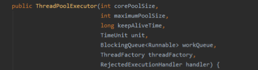

**线程池的 7 个参数：**

- **corePoolSize**：线程池核心线程大小维护一个最小线程数量，即使处于空闲状态也不销毁； 
- **maximumPoolSize**：线程池最大数量一个任务被提交到线程池，首先看有没有空闲线程，有则直接执行，没有则回缓存到工作队列如果队列满了才会创建一个新的线程，然后从工作队列的头部取出一个任务交由新线程处理，而将刚提交的任务放入工作队列尾部。线程池不会无限制的去创建线程，它会有一个最大连接数限制。 
- **keepAliveTIme**：空闲线程存活时间一个线程处于空闲状态，并且当前线程数量大于 `corePoolSize`，那么在指定时间后，这个空闲线程会销毁，这个指定时间就是这个； 
- **unit**：空闲线程存活时间单位 `keepAliveTime` 计量单位； 
- **workQueue**：工作队列：新任务提交后，会进入此工作队列，任务调度时再从队列中取出任务。 
  - 四种队列：
    1. **ArrayBlockingQueue**：基于 数组 有界 阻塞队列，按 FIFO 排序来，新任务进来会放到队尾，有界数组可以防止资源耗尽问题。当线程池中线程数达到 `corePoolSize` 后，再有新任务进来，则会将任务放置该队列的队尾，等待被调度。如果队列已经满了，最大线程数也到了，会执行拒绝策略对数组访问添加锁，支持多线程并发。
    2. **LinkedBlockingQueue**：基于 链表 无界 阻塞队列，其实最大容量时 **`Integer.Max`**。按照 FIFO 排序，由于该队列近似无界性，当队列到达 `corePoolSize` 时，再有任务进来会一直存入该队列，不会创建新线程直到 `MaximumPoolSize` ，因为使用该工作队列时，`MaximumPoolSize` 没用只能从 head 取元素，读写分离的，读写操作并行。采用重入锁保证并发安全。
    3. **SynchronousQueue**：一个不缓存任务的阻塞队列，生产者放入一个任务必须等到消费者取出这个任务，也就是说新任务进来时，不会缓存，而是直接被调度执行该任务，如果没有可用的线程，则创建新线程，如果线程数达到 `maxPoolSize`，则执行拒绝策略；缓冲队列，当中只能有一个，如果队列中有东西就阻塞。
    4. **PriorityBlokingQueue**：具有优先级的无界阻塞队列，优先级通过参数 Comparator实现； 
- **threadFactory**：线程工厂创建一个新线程时使用的工厂，可以用来设定线程名，是否未 deamon 线程等。
- **hander**：拒绝策略当工作队列中的任务已到达最大限制，并且线程池种得线程数量也到达最大限制，这时如果有新任务提交出来，该如何处理呢，这里的拒绝策略，就是解决这个问题的；
  - **CallRunsPolicy**：该策略下，在调用者线程中直接执行被拒绝任务的run方法，除非线程已经shutdown，则直接抛出任务。
  - **AbortPolicy**：该策略下，直接丢弃任务，并抛出 RejectedExecutionException 异常。
  - **DiscardPolicy**：该策略下，直接丢弃，什么也不做。
  - **DiscardOldPolicy**：该策略下，抛弃进入队列最早的那个任务，然后尝试把这次拒绝的任务放入队列。


## 线程池核心设计与实现

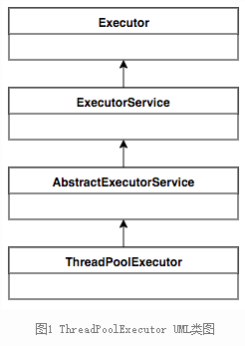

#### 总体设计

​		核心实现类是 ThreadPoolExecutor。

​		ThreadPoolExecutor 顶层接口是 Executor，顶层 Executor 提供了一种思想，将任务提交与任务执行进行解耦。用户无需关注如何创建线程、调度线程来执行任务，只需要提供 Runnable 对象，将任务运行逻辑提交到执行器中，由 Executor 来完成线程得调配和任务得执行部分。

ExecutorService 提供了一些能力：

- 扩充执行任务的能力：补充可以为一个或一批任务生成 Future 的方法。
- 提供了掌控线程池的方法：比如停止线程的运行。


#### ThreadPoolExecutor 运行机制

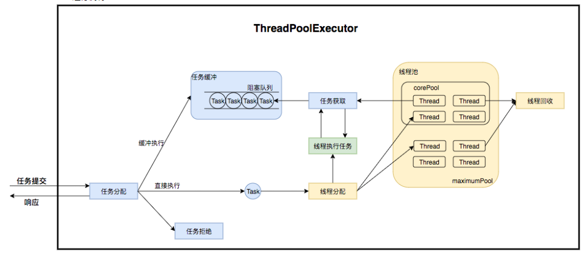

​		线程池在内部上实际构建了一个生产者消费者模型，将线程和任务进行解耦，并不直接关联，从而良好的缓冲任务，复用线程。 

线程池的运行主要分成了两个部分：任务管理、线程管理。

- **任务管理**：充当生产者角色，当任务提交后会判断任务后续的流转。
  1. 直接申请线程执行该任务。
  2. 缓冲到队列等待任务执行。
  3. 拒绝该任务。
- **线程管理**：充当消费者角色，被统一维护在线程池内，根据任务请求进行线程的分配，当线程执行完后则会继续获取新的任务去执行，最终当线程获取不到任务时，线程就会被回收。

#### 生命周期管理

线程池运行状态，并不是用户显示设置的，而是伴随线程池的运行，由内部来维护。

ThreadPoolExecutor 运行状态有 5 种。

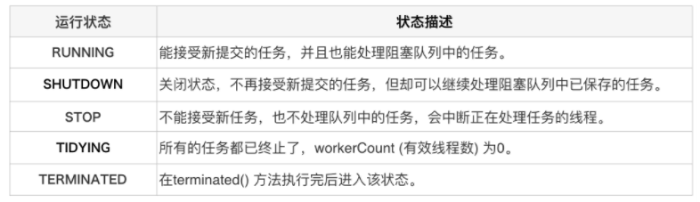

生命周期转换如下：

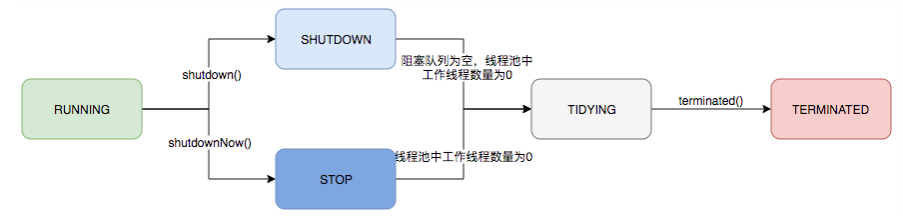

#### 任务执行机制

##### 任务调度

​		任务调度时线程池主要入口，当用户提交一个任务，接下来这个任务将如何执行都是由这个阶段决定的。

​		所有的调度都是由 executor 完成的。这部分完成的工作时：检查现在线程池的运行状态、运行线程数、运行策略，决定接下来的流程，时直接申请线程执行，还是缓冲到队列种执行，还是直接拒绝任务。

1. 首先按检查线程池运行状态，如果不是 RUNNING，直接拒绝，线程池要保证 RUNNING 状态下执行任务。
2. 如果workerCount  < coolPoolSize，则创建并启动一个线程来执行新提交的任务。
3. 如果 workerCount >= coolPoolSize，且线程池内的阻塞队列未满，则将任务添加到阻塞队列中。
4. 如果 workerCount >= coolPoolSize && wo'rkerCount < maximumPoolSize，且线程内的阻塞队列已满，则创建一个线程来执行新提交的任务。
5. 如果 workerCount >= maximumPoolSize，并且线程内的阻塞队列已满，则根据拒绝策略来处理该任务，默认的方法是直接抛异常。

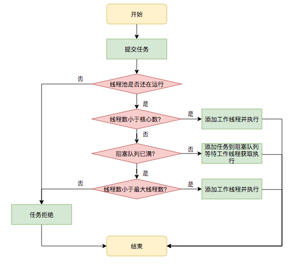

##### 任务缓冲

是线程池能够管理任务的核心部分，线程池本质上是对任务和线程的管理。

线程池是以生产者消费者模式，通过一个阻塞队列来实现，阻塞队列缓存任务，工作线程从阻塞队列获取任务。

阻塞队列是一个支持两个附加操作的队列：

- 当队列为空时，获取元素的线程会等待队列变为非空。
- 当队列满时，存储元素的线程会等待队列可用。

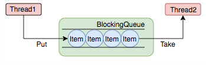

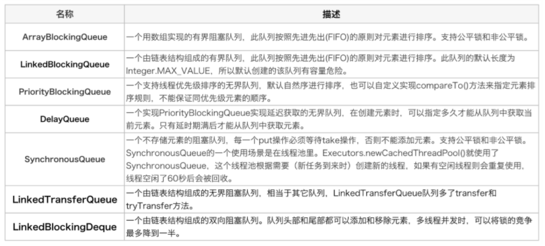

##### 任务申请

​		线程需要从任务缓存模块中不断的获取任务执行，帮助线程从阻塞队列种获取任务，实现线程管理模块和任务管理模块之间的通信，这部分策略由 getTask() 方法实现。

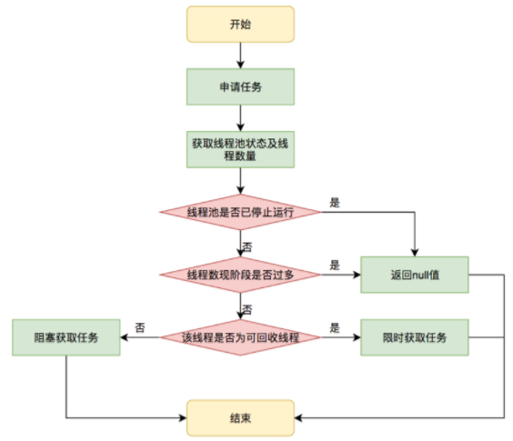

​		getTask() 进行了多次判断，为了是控制线程数量，使其符合线程池状态，如果线程池现在不应该持有这么多线程。则会返回 null 值，工作线程会不断的接收新任务去执行，而当工作线程 worker 接收不到任务时，就会开始被回收。

##### 任务拒绝

​		是线程池的保护部分，线程池有一个最大容量。当线程池的任务缓存队列已满，并且当线程池种任务数量达到 maximumPoolSize 时，就需要拒绝掉该任务，采用任务拒绝策略保护线程池。

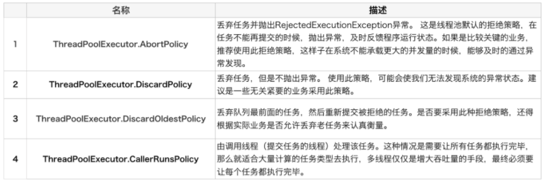


#### worker 线程管理

​		worker 这个工作线程，实现了 Runnable 接口。并持有一个线程 Thread。一个初始化的任务 firstTask。thrad 是在调用构造方法时通过 ThreadFactory 来创建的线程。可以用来执行任务。

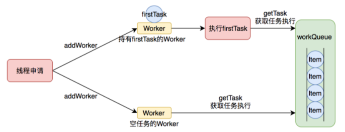

​		线程池需要管理线程的生命周期，需要在线程长时间不用的时候进行回收，线程池使用一张 Hash 表去持有线程的引用。这样可以通过添加引用、移除引用这样的操作来控制线程的生命周期。

​		worker 通过继承 AQS，使用 AQS 来实现独占锁这个功能。没有使用可重入 ReentrantLock，而是使用 AQS，为的就是实现不可重入的特性去反应线程现在的状态。

1. lock 方法一旦获取了独占锁，表示当前线程正在执行中。

2. 如果正在执行中的任务，则不应该中断线程。

3. 如果该线程现在不是独占锁的状态，也就是空闲的状态，说明它没有在处理任务，这时可以对线程进行中断。

4. 线程池在执行 shutdown 方法或者 tryTerminate 方法时回调在线程回收中就使用了这个特性。

   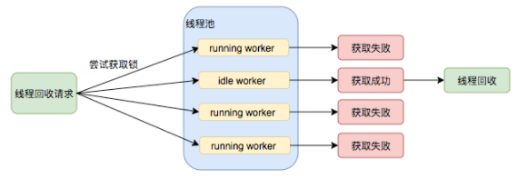

##### worker 线程增加

​		增加线程是通过线程池中的 addWorker() 方法，该方法的功能是增加一个线程，该方法不考虑线程池是在哪个阶段增加的这个线程，这个是线程分配的策略在上个步骤完成的。这个步骤仅仅是增加线程。并运行。

addWorker() 方法有两个参数：firstTask、core。

- firstTask：用于执行新增的一个线程执行的第一个任务，该参数可以为 null。

- core：参数为 true，表示在新增线程时会判断当前活动线程数是否少于 coolPoolSize。

  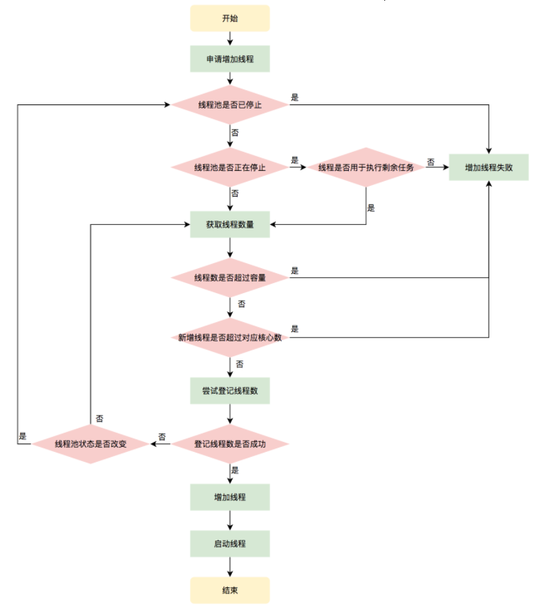

##### worker 线程回收

​		线程池中线程销毁依赖 jvm 自动回收，线程池的工作是根据当前线程池的状态维护一定数量的线程引用，防止这部分被 jvm 回收。当决定哪些线程需要回收时，只需要将其引用消除即可。worker 被创建出来后，就会不断的进行轮询，然后获取任务去执行。核心线程可以无限等待获取任务。非核心线程限时获取任务。当 worker 无法获取到任务时，也就是获取的任务为空时，worker 会主动消除自身在线程内的引用。

**线程回收工作是在 processWorkerExit 方法完成的。**


​		这个方法中，将线程引用移除线程池就已经完成了线程销毁的部分。由于线程销毁的情况有很多，还要判断是什么引发了这次销毁，是否要改变线程池现阶段的状态，是否要根据新状态重新分配线程。

##### worker 线程执行任务

在 Worker 类中的 run 方法调用了 runWorker 方法来执行任务。

1. Worker 循环不断的通过 getTask() 方法获取任务。
2. getTask() 方法从阻塞队列中获取任务。
3. 如果线程池正在停止，那么要保证当前线程是中断状态，否则要保证当前线程不是中断状态。
4. 执行任务。
5. 如果 getTask() 结果为 null 则跳出循环，执行 processWorkerExit() 方法，销毁线程。


