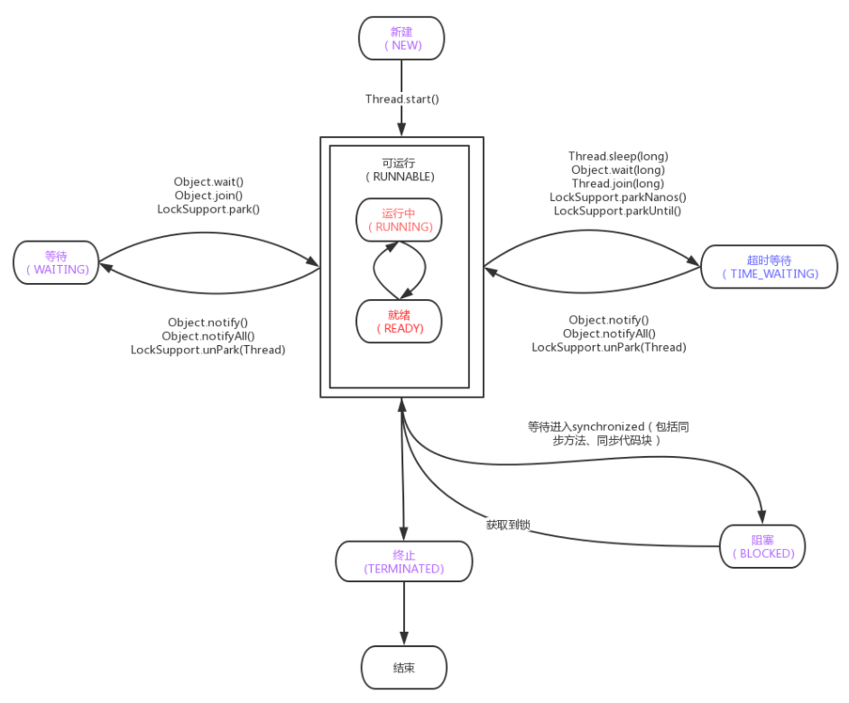

## 线程的状态

java 线程有以下 5 中状态。

|   线程状态    |                             含义                             |
| :-----------: | :----------------------------------------------------------: |
|      NEW      |       新建状态，线程已经创建，但是没有执行start()方法        |
|   RUNNABLE    |  可运行状态，线程可以在JVM中运行，但是还需要等待CPU分配资源  |
|    BLOCKED    | 阻塞状态，当遇到synchronized且没有取得相应的锁，就会进入这个状态 |
|    WAITING    | 等待状态，当线程中wait()/join/Locksupport.park方法时，就会进入这个状态 |
| TIMED_WAITING | 计时等待状态，当调用Thread.sleep()或者Object.wait(xx)或者Thread.join(xx)或者LockSupport.parkNanos或者LockSupport.partUntil时，进入该状态 |
|  TERMINATED   |    线程中断状态，线程被中断或者运行结束，就会进入这个状态    |

5 种状态对应不同的方法：



> 在上图中 `标红` 的两个状态，是操作系统中线程对应的状态，Java将这两种状态合并为 **可运行状态(RUNNABLE)**。在操作系统中 **就绪状态(READY)** 表示线程已经准备完毕，等待 CPU 分配时间片。**运行中状态(RUNNING)** 表示当线程分到时间片，线程开始正式执行。


## volatile 的使用

​		在 Java 内存模型中，为了提示程序的运行速度，Java 将内存分为了工作内存（线程独占，不与其他线程共享）与主内存。当多个线程同时访问同一个对象或者变量的时候，由于每个线程都需要将该对象或变量拷贝到自己的工作内存中。又因为线程的工作内存是私有且不与其他线程共享的。那么当一线程修改变量的值后，会导致对其他线程不可见。


volatile关键字修饰变量，就是告知线程对该变量的访问必须从主内存中获取。而对它的改变必须同步刷新到主内存中。这样就能保证线程对变量访问的可见性。


## synchronized 的使用

可以使用 `synchronized` 及 `Object` 中的配套方法 `wait()/notify() 、 wait()/notifyAll` 来实现线程的通信。

synchronized 保证了线程对变量访问的 **可见性** 和 **排他性**。


## synchronized 等待/通知机制

如果使用 synchronized 来实现线程间的通信，我们需要结合 Object 中的配套方法 `wait()/notify() 、 wait()/notifyAll`。

| 方法名称        |                             描述                             |
| :-------------- | :----------------------------------------------------------: |
| wait()          | 调用该方法的线程进入 `WAITING` 状态，只有等待另外线程的通知或被中断才会返回，需要注意，线程调用 wait() 方法前，需要获得对象的监视器。当调用 wait() 方法后，会释放对象的监视器 |
| wait(long)      | 调用该方法的线程进入 `TIMED_WAITING` 状态，这里的参数时间是毫秒，等待对应毫秒事件，如果没有收到其他线程通知，则超时返回 |
| wait(long, int) | 调用该方法的线程进入 `TIMED_WAITING` 状态，基本作用同 wait(long)，第二个参数代表为纳秒，也就是等待时间为毫秒+纳秒。 |
| notify()        | 通知一个在对象监视器上等待的线程，使其从 wait() 方法返回，而返回的前提是该线程获取到了对象的监视器。 |
| notifyAll()     |   通知所有在监视器上等待的线程，具体唤醒那个线程由CPU决定    |

​		使用 Object 的 wait() / notify()、wait() / notifyall() ，其实是我们经常使用的 `等待/通知机制`，所谓的 等待/通知机制 是指一个线程 A 调用了对象 O 的 wait() 方法进入等待状态，而另一个线程 B 调用了对象 O 的 notify 或者 notifyAll 方法。线程 A 收到通知后从对象 O 的 wait() 方法返回，进而执行后续的操作。

#### 结论

- 使用 wait()、notify() 和 notifyAll 时需要先获取对象的监视器（执行 monitorenter 指令成功）
- 调用 wait() 方法后，线程状态由 **RUNNING** 变为 **WAITING**，并将该线程加入等待队列。
- notify() 或 notifyAll() 方法调用后，等待线程依旧不会从 wait() 返回，需要调用 notify() 或 notfifyAll() 的线程释放对象的监视器（也就是执行 monitorexit 指令）后，等待线程才会有机会从wait()返回。
- notify() 方法将等待队列中的一个等待线程从等待队列移到同步队列中，而 notifyAll() 方法则是将等待队列中所有的线程全部移动到同步队列，被移动的线程状态由 **WAITING** 变为 **BLOCKED** 。
- 从 wait() 方法返回的前提是获得了调用对象的监视器 (执行 monitorenter 指令成功）。


## Lock 等待/通知机制

```java
class LockDemo {

    static boolean flag = true;
    static Lock lock = new ReentrantLock();
    static Condition codition = lock.newCondition();


    public static void main(String[] args) throws InterruptedException {
        new Thread(new WaitRunnable(), "WaitThread").start();
        TimeUnit.SECONDS.sleep(1);//这里睡眠，是保证Wait线程先执行
        new Thread(new NotifyRunnable(), "NotifyThread").start();
    }

    static class WaitRunnable implements Runnable {
        @Override
        public void run() {
            lock.lock();
            try {
                while (flag) {
                    String name = Thread.currentThread().getName();
                    System.out.println(name + "--->wait in " + new SimpleDateFormat("HH:mm:ss").format(new Date()));
                    codition.await();
                    System.out.println(name + "--->wake up in " + new SimpleDateFormat("HH:mm:ss").format(new Date()));
                }
            } catch (InterruptedException e) {
                e.printStackTrace();
            } finally {
                lock.unlock();
            }

        }
    }

    static class NotifyRunnable implements Runnable {
        @Override
        public void run() {
            lock.lock();
            try {
                String name = Thread.currentThread().getName();
                System.out.println(name + "--->notify all in " + new SimpleDateFormat("HH:mm:ss").format(new Date()));
                flag = false;
                codition.signalAll();
            } finally {
                lock.unlock();
            }
        }
    }
}
```


## 等待/通知经典范式

#### 等待方

等待方应遵循如下原则：

1. 获取对象的锁。
2. 如果条件不满足，调用对象的 wait() 方法， 被通知后仍然要检查条件。
3. 条件满足则执行响应逻辑。

#### 通知方

通知方应遵循如下原则：

1. 获得对象的锁。
2. 改变条件。
3. 通知所有等待在对象上的线程。


## Thread.join()

​		当线程 A 调用线程 B 对象（bThread)的join方法，其含义是当前线程 A 等待线程 B 终止后，才从线程 A 中 bThread.join() 代码的调用处返回。线程除了 join 方法以外还提供了 join(long millis) 和 void join(long millis, int nanos) 这两个具备超时特性的方法。这两个方法的意义是如果在给定的时间内线程B没有终止。那么线程A将会从该方法中返回。

> join() 方法内部会调用 join(final long millis) 方法。


## ThreadLocal


> 引用：https://juejin.cn/post/6844903919781412877