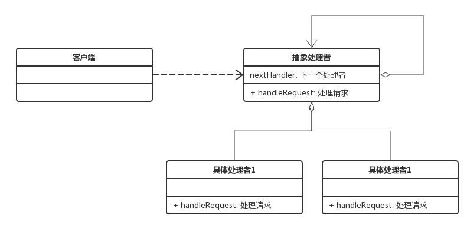
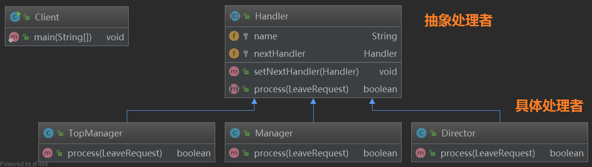

## 责任链模式

一个事件需要经过多个对象处理场景。

例：审批流程、请假流程、异常处理流程、web请求处理流程。


## 定义

避免请求发送者与接收者耦合在一起，让多个对象都有可能接收请求，将这些对象连接成一条链，并且沿着这条链传递请求，知道有对象处理它为止，职责链模式是一种对象行为模式。


## 角色

#### Handler（抽象处理者）

它定义了一个处理请求的接口，一般设计为抽象类，由于不同的具体处理者处理请求的方式不同，因此在其中定义了抽象请求处理方法。因为每一个处理者的下家还是一个处理者，因此在抽象处理者中定义了一个抽象处理者类型的对象，作为其对下家的引用。通过该引用，处理者可以连成一条链。

#### ConcreteHandler（具体处理者）

它是抽象处理者的子类，可以处理用户请求，在具体处理者类中实现了抽象处理者中定义的抽象请求处理方法，在处理请求之前需要进行判断，看是否有相应的处理权限，如果可以处理请求就处理它，否则将请求转发给后继者；在具体处理者中可以访问链中下一个对象，以便请求的转发。


## 类图



## 纯与不纯的责任链模式

#### 纯的责任链模式

- 一个具体处理者对象只能在两个行为中选择一个；要么承担全部责任，要么将责任推给下架，不允许出现某一个具体处理者对象在承担了一部分或全部责任后，又将责任向下传递的情况。
- 一个请求必须被某一个处理者对象所接收，不能出现某个请求未被任何一个处理者对象处理的情况。

#### 不纯的责任链模式

- 允许某个请求被一个具体处理者部分处理后再向下传递。
- 或者一个具体处理者处理完某个请求后其后继处理者可以继续处理该请求。
- 而且一个请求可以最终不被任何处理者对象所接收。


## 示例

不纯的责任链模式重构请假流程。

#### 请假信息类

```java
@Data
@AllArgsConstructor
public class LeaveRequest {
    private String name;    // 请假人姓名
    private int numOfDays;  // 请假天数
}
```

#### 抽象处理者类 Hander

维护一个 nextHandler 属性，该属性为当前处理者的下一个处理者的引用。

```java
@Data
public abstract class Handler {
    // 处理者姓名
    protected String name;
    // 下一个处理者
    protected Handler nextHandler;

    public Handler(String name) {
        this.name = name;
    }

    // 处理请假
    public abstract boolean process(LeaveRequest leaveRequest);
}
```

#### 处理类

分别实现了抽象处理类的 process 方法

```java
// 主管处理者
public class Director extends Handler {
    public Director(String name) {
        super(name);
    }

    @Override
    public boolean process(LeaveRequest leaveRequest) {
        boolean result = (new Random().nextInt(10)) > 3; // 随机数大于3则为批准，否则不批准
        String log = "主管<%s> 审批 <%s> 的请假申请，请假天数： <%d> ，审批结果：<%s> ";
        System.out.println(String.format(log, this.name, leaveRequest.getName(), leaveRequest.getNumOfDays(), result == true ? "批准" : "不批准"));

        if (result == false) {  // 不批准
            return false;
        } else if (leaveRequest.getNumOfDays() < 3) { // 批准且天数小于3，返回true
            return true;
        }
        return nextHandler.process(leaveRequest);   // 批准且天数大于等于3，提交给下一个处理者处理
    }
}

// 经理
public class Manager extends Handler {
    public Manager(String name) {
        super(name);
    }

    @Override
    public boolean process(LeaveRequest leaveRequest) {
        boolean result = (new Random().nextInt(10)) > 3; // 随机数大于3则为批准，否则不批准
        String log = "经理<%s> 审批 <%s> 的请假申请，请假天数： <%d> ，审批结果：<%s> ";
        System.out.println(String.format(log, this.name, leaveRequest.getName(), leaveRequest.getNumOfDays(), result == true ? "批准" : "不批准"));

        if (result == false) {  // 不批准
            return false;
        } else if (leaveRequest.getNumOfDays() < 7) { // 批准且天数小于7
            return true;
        }
        return nextHandler.process(leaveRequest);   // 批准且天数大于等于7，提交给下一个处理者处理
    }
}

// 总经理
public class TopManager extends Handler {
    public TopManager(String name) {
        super(name);
    }

    @Override
    public boolean process(LeaveRequest leaveRequest) {
        boolean result = (new Random().nextInt(10)) > 3; // 随机数大于3则为批准，否则不批准
        String log = "总经理<%s> 审批 <%s> 的请假申请，请假天数： <%d> ，审批结果：<%s> ";
        System.out.println(String.format(log, this.name, leaveRequest.getName(), leaveRequest.getNumOfDays(), result == true ? "批准" : "不批准"));

        if (result == false) { // 总经理不批准
            return false;
        }
        return true;    // 总经理最后批准
    }
}
```

#### 客户端测试

```java
public class Client {
    public static void main(String[] args) {
        Handler zhangsan = new Director("张三");
        Handler lisi = new Manager("李四");
        Handler wangwu = new TopManager("王五");

        // 创建责任链
        zhangsan.setNextHandler(lisi);
        lisi.setNextHandler(wangwu);

        // 发起请假申请
        boolean result1 = zhangsan.process(new LeaveRequest("小旋锋", 1));
        System.out.println("最终结果：" + result1 + "\n");

        boolean result2 = zhangsan.process(new LeaveRequest("小旋锋", 4));
        System.out.println("最终结果：" + result2 + "\n");

        boolean result3 = zhangsan.process(new LeaveRequest("小旋锋", 8));
        System.out.println("最终结果：" + result3 + "\n");
    }
}
```

#### 可能结果

由于是否批准是通过随机数模拟的，所以结果可能不同。

```java
主管<张三> 审批 <小旋锋> 的请假申请，请假天数： <1> ，审批结果：<批准> 
最终结果：true

主管<张三> 审批 <小旋锋> 的请假申请，请假天数： <4> ，审批结果：<不批准> 
最终结果：false

主管<张三> 审批 <小旋锋> 的请假申请，请假天数： <8> ，审批结果：<批准> 
经理<李四> 审批 <小旋锋> 的请假申请，请假天数： <8> ，审批结果：<批准> 
总经理<王五> 审批 <小旋锋> 的请假申请，请假天数： <8> ，审批结果：<批准> 
最终结果：true
```




## 总结

#### 优点

- 对象仅需知道该请求会被处理即可，且链中的对象不需要知道链的结构，由客户端负责链的创建，**降低了系统的耦合度**。
- 请求处理对象仅需维持一个指向其后继者的引用，而不需要维持它对所有候选处理者的引用，**可简化对象的相互连接**。
- 在给对象分派职责时，职责链可以给我们更多的**灵活性**，可以在运行时对该链进行动态的增删改，改变处理一个请求的职责。
- 新增一个新的具体请求处理者时无需修改原有代码，只需要在客户端重新建链即可，符合 **开闭原则**。

#### 缺点

- 一个请求可能因职责链没有被正确配置而得不到处理。
- 对于比较长的职责链，请求的处理可能涉及到多个处理对象，**系统性能将收到一定影响**，且不方便调试。
- 可能因为职责链创建不当，造成循环调用，导致系统陷入死循环。


## 适用场景

- 有多个对象可以处理同一个请求，具体哪个对象处理该请求待运行时刻再确定，客户端只需将请求提交到链上，而无须关心请求的处理对象是谁以及它是如何处理的
- 在不明确指定接收者的情况下，向多个对象中的一个提交一个请求
- 可动态指定一组对象处理请求，客户端可以动态创建职责链来处理请求，还可以改变链中处理者之间的先后次序


## 典型应用

### Tomcat 过滤器中的责任链模式

`Servlet` 过滤器是可用于 `Servlet` 编程的 Java 类，可以实现以下目的：在客户端的请求访问后端资源之前，拦截这些请求；在服务器的响应发送回客户端之前，处理这些响应。

`Servlet` 定义了过滤器接口 `Filter` 和过滤器链接口 `FilterChain` 的源码如下

```java
public interface Filter {
    public void init(FilterConfig filterConfig) throws ServletException;
    public void doFilter(ServletRequest request, ServletResponse response, FilterChain chain) throws IOException, ServletException;
    public void destroy();
}

public interface FilterChain {
    void doFilter(ServletRequest var1, ServletResponse var2) throws IOException, ServletException;
}
```


 


